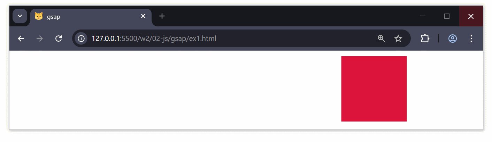
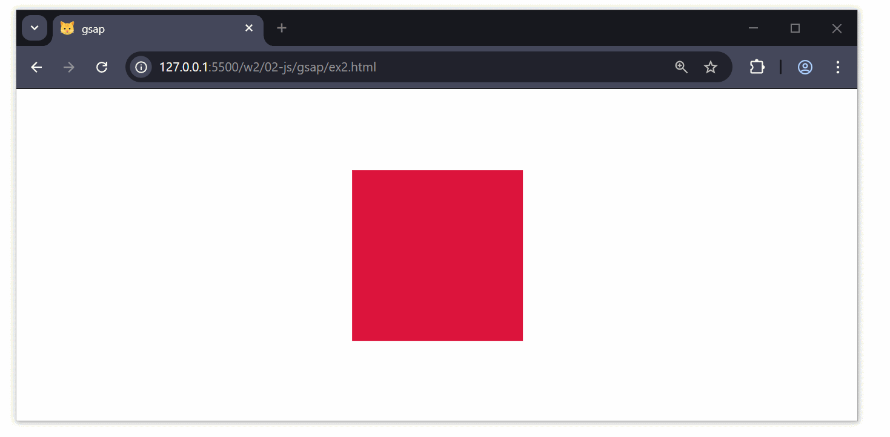
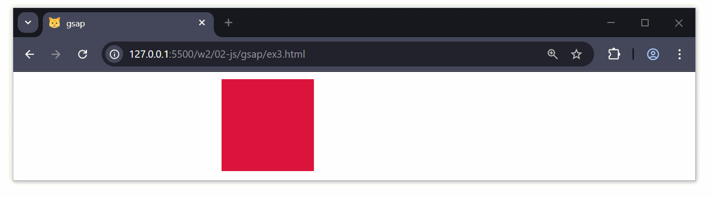
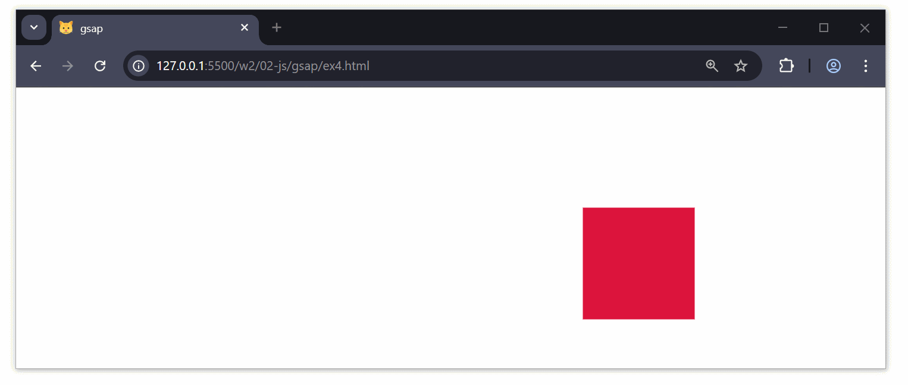
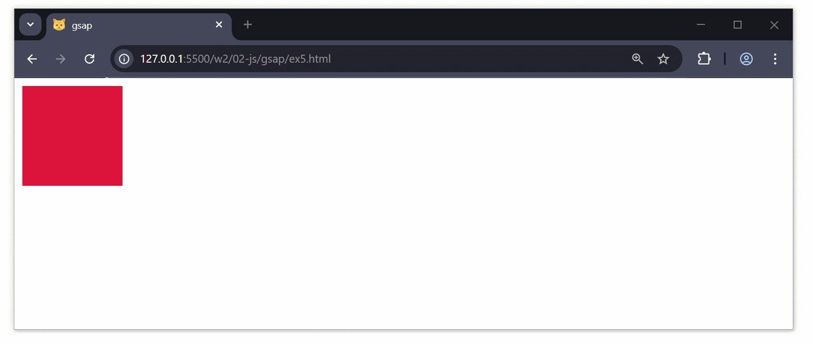
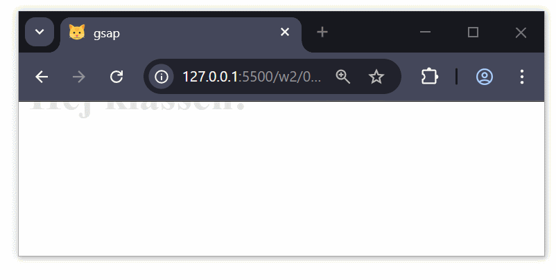
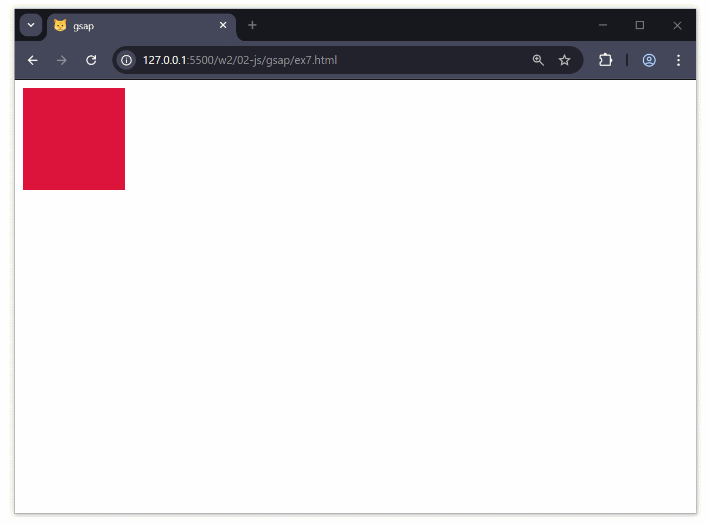
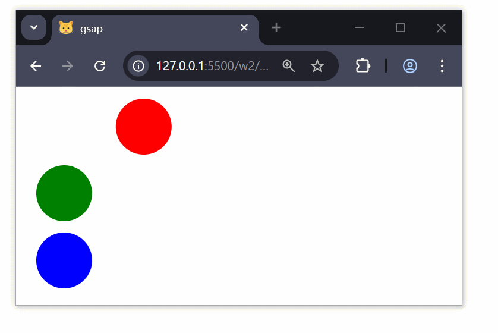

# Greensock (GSAP)

---

# Vad är Greensock (GSAP)?

--

GSAP (GreenSock Animation Platform) är ett kraftfullt JavaScript-bibliotek för att skapa animeringar på webben.

Används ofta för att skapa smidiga, prestandavänliga animationer med hög kontroll.

---

# Varför använda GSAP?

--

Prestandaoptimerade animationer

Stöd för alla moderna webbläsare

Fungerar med SVG, CSS, Canvas och WebGL

Tidslinjer och kontroll över animationer

Smidiga effekter utan CSS-animeringar

---

# Installation av GSAP

--

```html
<script src="https://cdnjs.cloudflare.com/ajax/libs/gsap/3.12.2/gsap.min.js"></script>
```

---

# Grundläggande animation

--

## Flytta ett element

```html
<div class="box"></div>

<script>
  gsap.to(".box", {
    x: 300,
    duration: 2,
  });
</script>
```

--



--

## Skalning och rotation

```js
gsap.to(".box", {
  scale: 1.5,
  rotation: 180,
  duration: 2,
});
```

--



--

## Loopande animation

```js
gsap.to(".box", {
  y: 100,
  repeat: -1,
  yoyo: true,
  duration: 1,
});
```

--



--

## Animering med tidslinje

### Version 1

```js
let tl = gsap.timeline();
tl.to(".box", { x: 200, duration: 1 })
  .to(".box", { y: 100, duration: 1 })
  .to(".box", { rotation: 360, duration: 1 });
```

--



--

### Version 2

```js
let tl = gsap.timeline({ repeat: -1, yoyo: true });
tl.to(".box", { x: 500, duration: 2, delay: 1 })
  .to(".box", { y: 100, duration: 2 })
  .to(".box", { rotation: 360, duration: 1 });
```

--



--

## Färgändring och fördröjning

```js
gsap.to(".box", {
  backgroundColor: "blue",
  duration: 2,
  delay: 1,
});
```

--


--

## Textanimation

```html
<h1 class="text">Hej klassen!</h1>

<script>
  gsap.from(".text", {
    opacity: 0,
    y: -50,
    duration: 2,
    repeat: -1,
    yoyo: true,
  });
</script>
```

--



--

## Elastic och Bounce-effekter

```js
gsap.to(".box", {
  x: 300,
  duration: 2,
  ease: "bounce.out",
});

gsap.to(".box", {
  y: 200,
  duration: 2,
  ease: "elastic.out(1, 0.3)",
});
```

--



--

## Animera flera element samtidigt

```js
gsap.to(".circle", {
  x: 200,
  duration: 1,
  stagger: 0.5,
});
```

--



--

## Scroll-trigger animation

```html
<script src="https://cdnjs.cloudflare.com/ajax/libs/gsap/3.12.2/ScrollTrigger.min.js"></script>
<script>
  gsap.registerPlugin(ScrollTrigger);

  gsap.to("#animatedBox", {
    x: 300,
    duration: 2,
    scrollTrigger: "#animatedBox",
  });
</script>
```

--


---

# Nu då?

--

[Free GreenSock Beginner Tutorials](https://www.youtube.com/playlist?list=PLSkIx8U0TMvgH2PEokYLIxofdb1L9cJjz)

Se och koda med **2-5**, **7-11**, **13**, **19**

I film #2 används codepen, men du använder givetvis Visual Studio Code.

---

# Länkar

[GSAPs officiella dokumentation](https://greensock.com/docs/)

[GSAP Basics: Dive into Web Animations](https://marmelab.com/blog/2024/03/27/gsap-basics-js-animation.html)

[Getting Started with GSAP: A Practical Guide](https://blog.bitsrc.io/practical-guide-to-getting-started-with-gsap-greensock-animation-platform-21ff9638ea70)

[GreenSock Tutorial for Beginners: Web Animation Library](https://shakuro.com/blog/greensock-tutorial-for-beginners-web-animation-library)
