# Demo vecka 3

---

# Demo 1

--

## HTML

```html []
<div class="app">
  <p class="js" onclick="run()">Klicka på mig</p>
</div>

<script src="app.js"></script>
```

--

## JS

### Steg 1

```js []
function run() {
  console.log("Klickad på!");
}
```

--

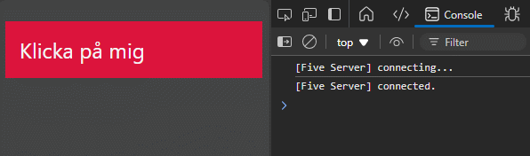

--

### Steg 2

```js []
function run() {
  const el = document.querySelector(".js");
  console.log(el);
}
```

--

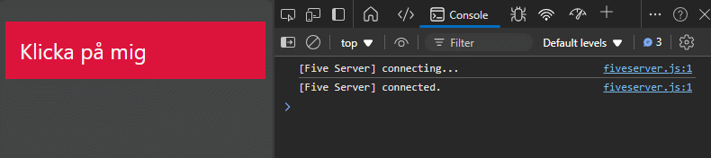

--

### Steg 3

```js []
function run() {
  const el = document.querySelector(".js");
  el.textContent = "Tada!";
  el.style.backgroundColor = "#b0b";
}
```

--

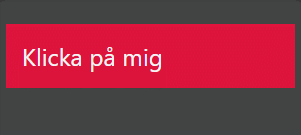

--

### Steg 4

```js []
let toggle = false;

function run() {
  const el = document.querySelector(".js");

  if (toggle == false) {
    el.textContent = "Tada!";
    el.style.backgroundColor = "#b0b";
    toggle = true;
  } else {
    el.textContent = "Klicka på mig!";
    el.style.backgroundColor = "crimson";
    toggle = false;
  }
}
```

--

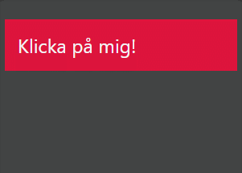

--

## Observera!

Idag använder vi oss helst inte av den här tekniken...

---

# Demo 2

--

## HTML

```html []
<div class="app">
  <ul>
    <li>Listenhet 1</li>
    <li>Listenhet 2</li>
    <li>Listenhet 3</li>
    <li>Listenhet 4</li>
    <li>Listenhet 5</li>
  </ul>
</div>

<script src="app.js"></script>
```

--

## JS

### Steg 1

```js []
const li = document.querySelector("li");
console.log(li.textContent);
```

--

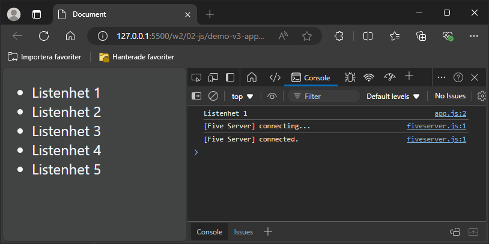

--

### Steg 2

```js []
const li = document.querySelectorAll("li");
console.log(li);
```

--

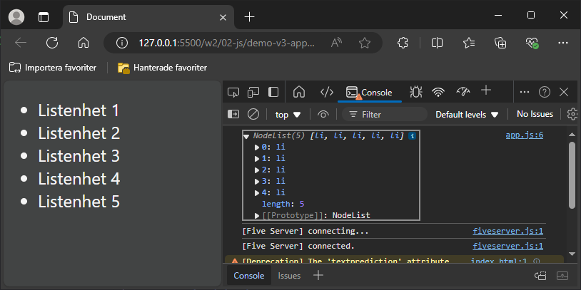

--

### Steg 3

```js []
const li = document.querySelectorAll("li");

li.forEach((element) => {
  console.log(element.textContent);
});
```

--

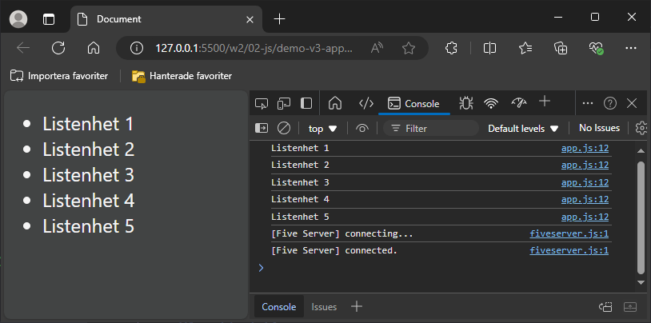

--

### Steg 4

```js []
const li = document.querySelectorAll("li");

li.forEach((element) => {
  console.log(element.textContent);
  element.textContent += "... så att säga";
  console.log(element.textContent);
});
```

--

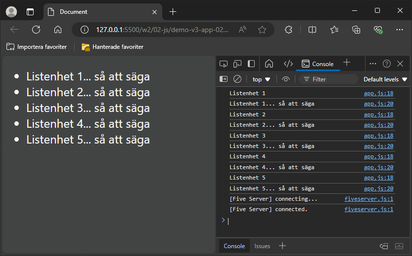

---

# Demo 3

--

## HTML

```html []
<div class="app">
  <button class="btn">Knappen</button>
</div>

<script src="app.js"></script>
```

--

## JS

### Steg 1

```js []
const btn = document.querySelector(".btn");

btn.addEventListener("click", function () {
  console.log("Klickad på");
});
```

--

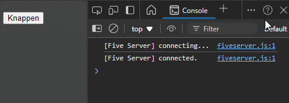

--

### Steg 2

```js []
const btn = document.querySelector(".btn");

btn.addEventListener("click", () => {
  console.log("Klickad på del 2");
});
```

--

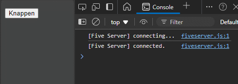

--

### Steg 3

```js []
const btn = document.querySelector(".btn");

function myBtn() {
  console.log("Klickad på del 3");
}

btn.addEventListener("click", myBtn);
```

--

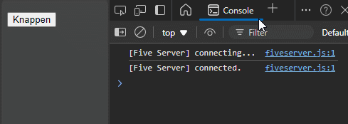

---

# Demo 4

--

## HTML

```html []
<div class="app">
  <button class="btn">Knapp en</button>
  <button class="btn">Knapp två</button>
  <button class="btn">Knapp tre</button>

  <div class="content"></div>
</div>

<script src="app.js"></script>
```

--

## JS

### Steg 1

```js []
const btns = document.querySelectorAll(".btn");

btns.forEach((btn) => {
  btn.addEventListener("click", () => {
    console.log(btn.textContent);
  });
});
```

--

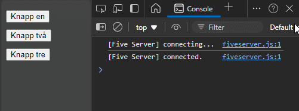

--

### Steg 2

```js []
const btns = document.querySelectorAll(".btn");
let content = document.querySelector(".content");

btns.forEach((btn) => {
  btn.addEventListener("click", () => {
    content.textContent = btn.textContent;
  });
});
```

--

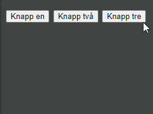

--

### Steg 3

```js []
const btns = document.querySelectorAll(".btn");
let content = document.querySelector(".content");
let counter = 0;

btns.forEach((btn) => {
  btn.addEventListener("click", () => {
    counter++;
    content.textContent = `Nu är värdet: ${counter}`;
  });
});
```

--

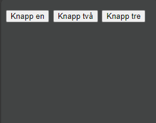

--

**Template literal**, skapas med backticks **`** istället för enkla **'** eller dubbla **"** citattecken.

**${visitors}**, en placeholder inom template literal.

---

# SLUT!
