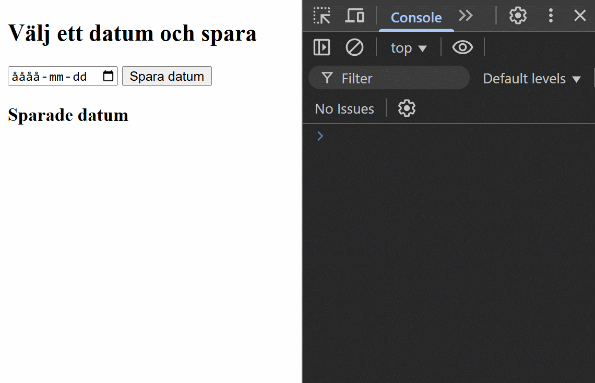
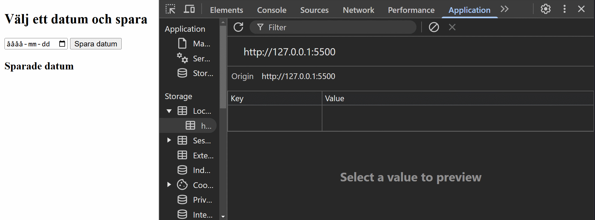
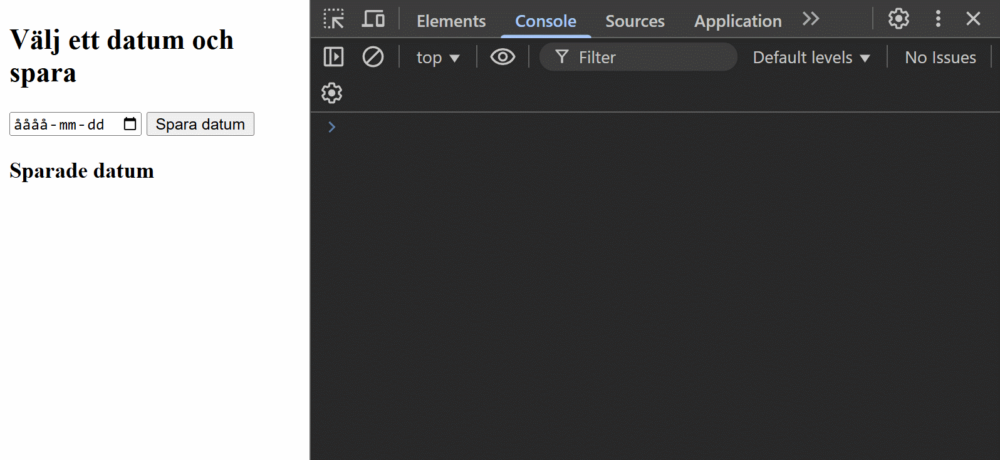
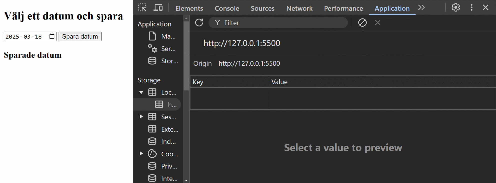
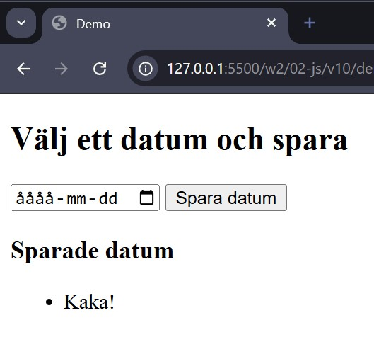
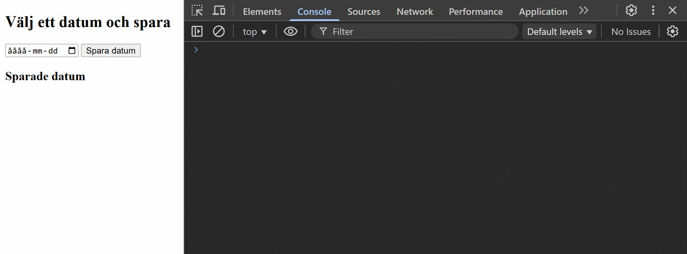
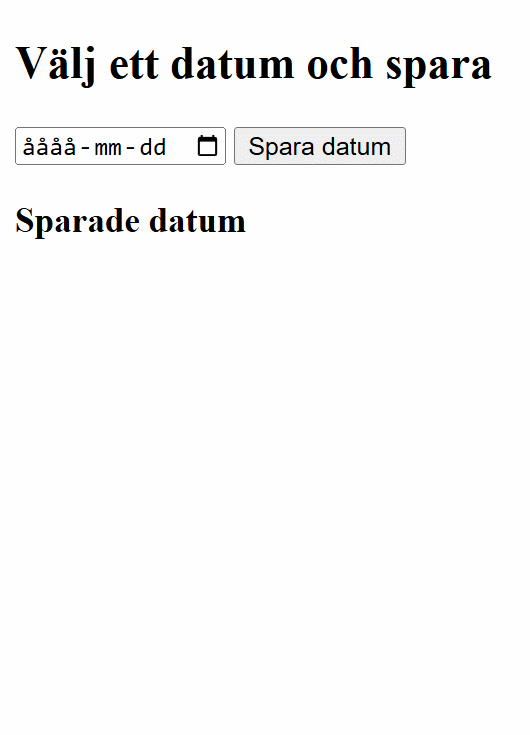

# Mer om användning av localstorage

---

# Mål

--

Vi ska bygga en applikation som kan spara datum i localstorage

Vi ska kunna spara mer äm ett datum

---

# index.html

--

```html []
<link rel="stylesheet" href="css/style.css" />
<script src="js/app.js" type="module" defer></script>
```

```html []
<div class="app">
  <section class="add">
    <h2 class="headline">Välj ett datum och spara</h2>

    <input type="date" id="datePicker" />
    <button id="saveDate">Spara datum</button>
  </section>

  <section class="list">
    <h3 class="headline">Sparade datum</h3>
    <ul id="dateList"></ul>
  </section>
</div>
```

---

# app.js - Steg 1

--

```js []
const datePicker = document.querySelector("#datePicker");
const saveButton = document.querySelector("#saveDate");

saveButton.addEventListener("click", () => {
  console.log(`Värdet är: ${datePicker.value}`);
});
```

--



---

# app.js - Steg 2

--

```js [5-7]
const datePicker = document.querySelector("#datePicker");
const saveButton = document.querySelector("#saveDate");

saveButton.addEventListener("click", () => {
  if (datePicker.value) {
    console.log(`Värdet är: ${datePicker.value}`);
  }
});
```

--


---

# app.js - Steg 3

--

```js [4-7, 10]
const datePicker = document.querySelector("#datePicker");
const saveButton = document.querySelector("#saveDate");

function saveDate(date) {
  console.log(`Värdet är: ${date}`);
}

saveButton.addEventListener("click", () => {
  if (datePicker.value) {
    saveDate(datePicker.value);
  }
});
```

--


---

# app.js - Steg 4

--

```js [5]
const datePicker = document.querySelector("#datePicker");
const saveButton = document.querySelector("#saveDate");

function saveDate(date) {
  localStorage.setItem("datum", date);
}

saveButton.addEventListener("click", () => {
  if (datePicker.value) {
    saveDate(datePicker.value);
  }
});
```

--



---

# app.js - Steg 5

--

```js [4-11]
const datePicker = document.querySelector("#datePicker");
const saveButton = document.querySelector("#saveDate");

function saveDate(date) {
  const newDate = {
    id: Date.now(),
    saved: date,
  };

  console.log(newDate);
}

saveButton.addEventListener("click", () => {
  if (datePicker.value) {
    saveDate(datePicker.value);
  }
});
```

--



---

# app.js - Steg 6

--

```js [5,12,13]
const datePicker = document.querySelector("#datePicker");
const saveButton = document.querySelector("#saveDate");

function saveDate(date) {
  let dates = JSON.parse(localStorage.getItem("savedDates")) || [];

  const newDate = {
    id: Date.now(),
    saved: date,
  };

  dates.push(newDate);
  localStorage.setItem("savedDates", JSON.stringify(dates));
}

saveButton.addEventListener("click", () => {
  if (datePicker.value) {
    saveDate(datePicker.value);
  }
});
```

--

### let dates = JSON.parse(<br>localStorage.getItem("savedDates")) || [];

**localStorage.getItem("savedDates")** hämtar en sträng från webbläsarens localStorage med nyckeln "savedDates".

--

**JSON.parse(...)** konverterar den strängen till ett JavaScript-arrayobjekt (eftersom den sparats som en JSON-sträng).

--

**|| []** används som en fallback. Om localStorage.getItem("savedDates") returnerar null (dvs. om inget tidigare sparats), så tilldelas dates en tom array [].

--

### localStorage.setItem("savedDates", JSON.stringify(dates));

**JSON.stringify(dates)**

Konverterar dates (en JavaScript-array med sparade datumobjekt) till en JSON-sträng.
Detta behövs eftersom localStorage bara kan lagra strängar.

--

**localStorage.setItem("savedDates", ...)**

Sparar den JSON-strängifierade versionen av dates i localStorage under nyckeln "savedDates".

Om "savedDates" redan existerar, skrivs den över med den nya uppdaterade listan.

--



---

# app.js - Steg 7

--

```js [3, 17-21]
const datePicker = document.querySelector("#datePicker");
const saveButton = document.querySelector("#saveDate");
const showDates = document.querySelector("#dateList");

function saveDate(date) {
  let dates = JSON.parse(localStorage.getItem("savedDates")) || [];

  const newDate = {
    id: Date.now(),
    saved: date,
  };

  dates.push(newDate);
  localStorage.setItem("savedDates", JSON.stringify(dates));
}

function showSavedDates(list) {
  let li = document.createElement("li");
  li.textContent = "Kaka!";
  list.appendChild(li);
}

saveButton.addEventListener("click", () => {
  if (datePicker.value) {
    saveDate(datePicker.value);
  }
});

showSavedDates(showDates);
```

--



---

# app.js - Steg 8

--

```js [17-25]
const datePicker = document.querySelector("#datePicker");
const saveButton = document.querySelector("#saveDate");
const showDates = document.querySelector("#dateList");

function saveDate(date) {
  let dates = JSON.parse(localStorage.getItem("savedDates")) || [];

  const newDate = {
    id: Date.now(),
    saved: date,
  };

  dates.push(newDate);
  localStorage.setItem("savedDates", JSON.stringify(dates));
}

function showSavedDates(list) {
  list.innerHTML = "";

  const allDates = JSON.parse(localStorage.getItem("savedDates")) || [];

  allDates.forEach((date) => {
    console.log(date);
  });
}

saveButton.addEventListener("click", () => {
  if (datePicker.value) {
    saveDate(datePicker.value);
    showSavedDates(showDates);
  }
});

showSavedDates(showDates);
```

--



Problem!

---

# app.js - Steg 9

--

```js [17-25]
const datePicker = document.querySelector("#datePicker");
const saveButton = document.querySelector("#saveDate");
const showDates = document.querySelector("#dateList");

function saveDate(date) {
  let dates = JSON.parse(localStorage.getItem("savedDates")) || [];

  const newDate = {
    id: Date.now(),
    saved: date,
  };

  dates.push(newDate);
  localStorage.setItem("savedDates", JSON.stringify(dates));
}

function showSavedDates(tagg) {
  const allDates = JSON.parse(localStorage.getItem("savedDates")) || [];

  allDates.forEach((date) => {
    const li = document.createElement("li");
    li.textContent = date.saved;
    tagg.appendChild(li);
  });
}

saveButton.addEventListener("click", () => {
  if (datePicker.value) {
    saveDate(datePicker.value);
    showSavedDates(showDates);
  }
});

showSavedDates(showDates);
```

--



---

# app.js - Steg 10

--

```js [18]
const datePicker = document.querySelector("#datePicker");
const saveButton = document.querySelector("#saveDate");
const showDates = document.querySelector("#dateList");

function saveDate(date) {
  let dates = JSON.parse(localStorage.getItem("savedDates")) || [];

  const newDate = {
    id: Date.now(),
    saved: date,
  };

  dates.push(newDate);
  localStorage.setItem("savedDates", JSON.stringify(dates));
}

function showSavedDates(tagg) {
  tagg.innerHTML = "";

  const allDates = JSON.parse(localStorage.getItem("savedDates")) || [];

  allDates.forEach((date) => {
    const li = document.createElement("li");
    li.textContent = date.saved;
    tagg.appendChild(li);
  });
}

saveButton.addEventListener("click", () => {
  if (datePicker.value) {
    saveDate(datePicker.value);
    showSavedDates(showDates);
  }
});

showSavedDates(showDates);
```

--


---

# Dags att modulisera

--

## saveDate.js

```js []
export function saveDate(date) {
  let dates = JSON.parse(localStorage.getItem("savedDates")) || [];

  const newDate = {
    id: Date.now(),
    saved: date,
  };

  dates.push(newDate);
  localStorage.setItem("savedDates", JSON.stringify(dates));
}
```

--

## showDates.js

```js []
export function showSavedDates(tagg) {
  tagg.innerHTML = "";

  const allDates = JSON.parse(localStorage.getItem("savedDates")) || [];

  allDates.forEach((date) => {
    const li = document.createElement("li");
    li.textContent = date.saved;
    tagg.appendChild(li);
  });
}
```

--

## app.js

```js []
import { saveDate } from "./saveDate.js";
import { showSavedDates } from "./showDates.js";

const datePicker = document.querySelector("#datePicker");
const saveButton = document.querySelector("#saveDate");
const showDates = document.querySelector("#dateList");

saveButton.addEventListener("click", () => {
  if (datePicker.value) {
    saveDate(datePicker.value);
    showSavedDates(showDates);
  }
});

showSavedDates(showDates);
```

---

# Slut!
