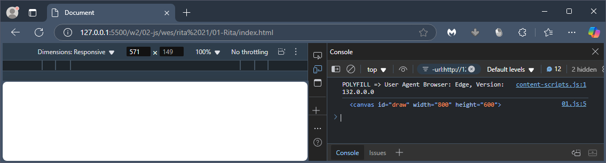
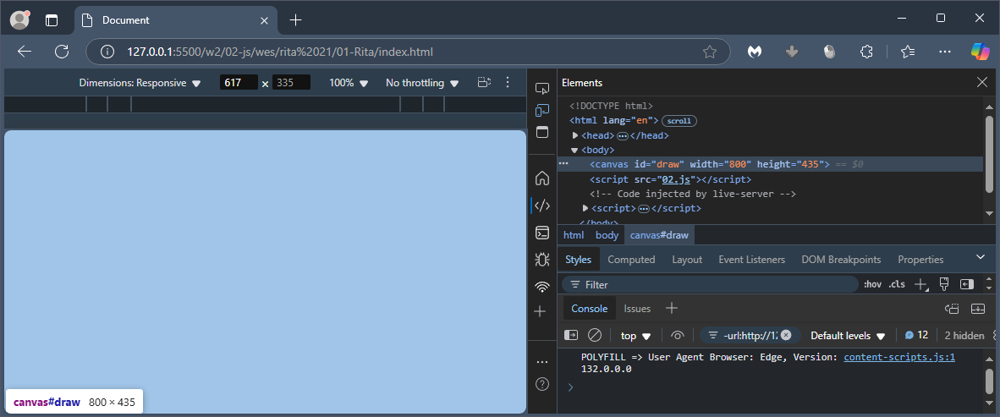
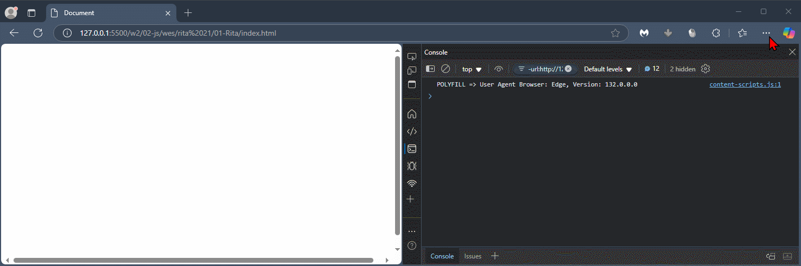
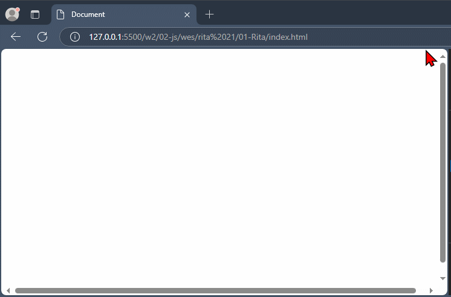
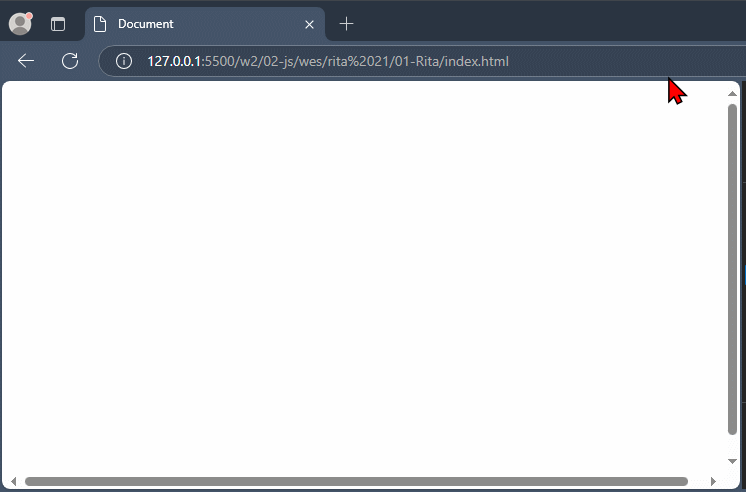
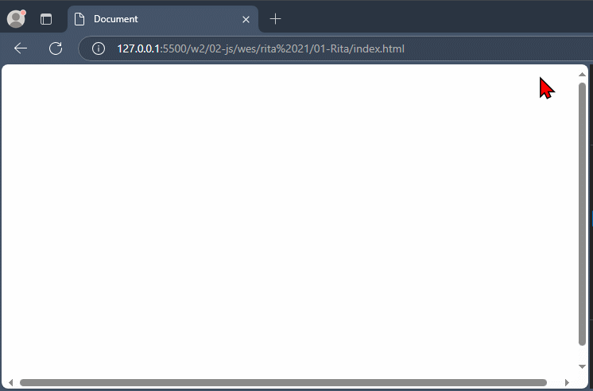
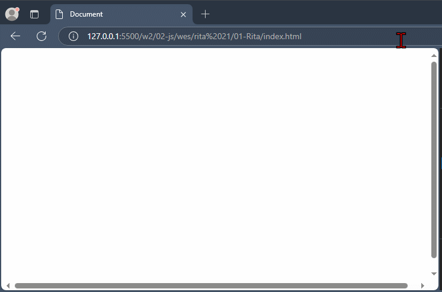
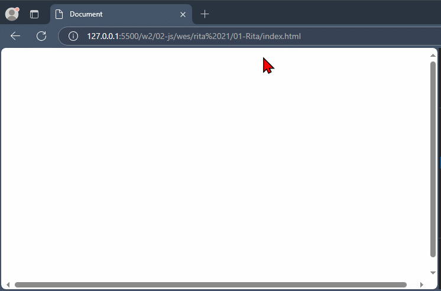

# Rita på canvas

---

# Steg 0

--

```html
<canvas id="draw" width="800" height="600"></canvas>
```

---

# Steg 1

--

```js []
"use strict";

const canvas = document.querySelector("#draw");
console.log(canvas);
```

--



--

## Use strict

Aktiverar strict mode i JavaScript.

Är ett sätt att köra koden på ett striktare sätt, vilket hjälper till att undvika vanliga buggar och fel.

Man kan inte använda odeklarerade variabler.

---

# Steg 2

--

```js [5-7]
"use strict";

const canvas = document.querySelector("#draw");

// Modifierar storleken på canvases
canvas.width = window.innerWidth;
canvas.height = window.innerHeight;
```

--



---

# Steg 3

--

```js [8-23]
"use strict";

const canvas = document.querySelector("#draw");

canvas.width = window.innerWidth;
canvas.height = window.innerHeight;

// Context 2d
const ctx = canvas.getContext("2d");

ctx.strokeStyle = "#b0b";
ctx.lineJoin = "round";
ctx.lineCap = "round";

let isDrawing = false;
let lastX = 0;
let lastY = 0;

function draw(e) {
  console.log(e);
}

canvas.addEventListener("mousemove", draw);
```

--


---

# Steg 4

--

```js [18-21, 25-35]
"use strict";

const canvas = document.querySelector("#draw");

canvas.width = window.innerWidth;
canvas.height = window.innerHeight;

const ctx = canvas.getContext("2d");

ctx.strokeStyle = "#b0b";
ctx.lineJoin = "round";
ctx.lineCap = "round";

let isDrawing = false;
let lastX = 0;
let lastY = 0;

function draw(e) {
  if (!isDrawing) return;
  console.log(e);
}

canvas.addEventListener("mousemove", draw);

canvas.addEventListener("mousedown", function () {
  isDrawing = true;
});

canvas.addEventListener("mouseup", function () {
  isDrawing = false;
});

canvas.addEventListener("mouseout", function () {
  isDrawing = false;
});
```

--



---

# Steg 5

--

```js [18-27]
"use strict";

const canvas = document.querySelector("#draw");

canvas.width = window.innerWidth;
canvas.height = window.innerHeight;

const ctx = canvas.getContext("2d");

ctx.strokeStyle = "#b0b";
ctx.lineJoin = "round";
ctx.lineCap = "round";

let isDrawing = false;
let lastX = 0;
let lastY = 0;

function draw(e) {
  if (!isDrawing) return;

  ctx.beginPath();
  // Start
  ctx.moveTo(lastX, lastY);
  // Stopp
  ctx.lineTo(e.offsetX, e.offsetY);
  ctx.stroke();
}

canvas.addEventListener("mousemove", draw);

canvas.addEventListener("mousedown", function () {
  isDrawing = true;
});

canvas.addEventListener("mouseup", function () {
  isDrawing = false;
});

canvas.addEventListener("mouseout", function () {
  isDrawing = false;
});
```

--



---

# Steg 6

--

```js [28-29]
"use strict";

const canvas = document.querySelector("#draw");

canvas.width = window.innerWidth;
canvas.height = window.innerHeight;

const ctx = canvas.getContext("2d");

ctx.strokeStyle = "#b0b";
ctx.lineJoin = "round";
ctx.lineCap = "round";

let isDrawing = false;
let lastX = 0;
let lastY = 0;

function draw(e) {
  if (!isDrawing) return;

  ctx.beginPath();
  // Start
  ctx.moveTo(lastX, lastY);
  // Stopp
  ctx.lineTo(e.offsetX, e.offsetY);
  ctx.stroke();

  lastX = e.offsetX;
  lastY = e.offsetY;
}

canvas.addEventListener("mousemove", draw);

canvas.addEventListener("mousedown", function () {
  isDrawing = true;
});

canvas.addEventListener("mouseup", function () {
  isDrawing = false;
});

canvas.addEventListener("mouseout", function () {
  isDrawing = false;
});
```

--



---

# Steg 7

--

```js [38-39]
"use strict";

const canvas = document.querySelector("#draw");

canvas.width = window.innerWidth;
canvas.height = window.innerHeight;

const ctx = canvas.getContext("2d");

ctx.strokeStyle = "#b0b";
ctx.lineJoin = "round";
ctx.lineCap = "round";
ctx.lineWidth = 10;

let isDrawing = false;
let lastX = 0;
let lastY = 0;

function draw(e) {
  if (!isDrawing) return;

  ctx.beginPath();
  // Start
  ctx.moveTo(lastX, lastY);
  // Stopp
  ctx.lineTo(e.offsetX, e.offsetY);
  ctx.stroke();

  lastX = e.offsetX;
  lastY = e.offsetY;
}

canvas.addEventListener("mousemove", draw);

canvas.addEventListener("mousedown", function (e) {
  isDrawing = true;

  lastX = e.offsetX;
  lastY = e.offsetY;
});

canvas.addEventListener("mouseup", function () {
  isDrawing = false;
});

canvas.addEventListener("mouseout", function () {
  isDrawing = false;
});
```

--



---

# Steg 8

--

```js [19, 24, 36-38]
"use strict";

const canvas = document.querySelector("#draw");

canvas.width = window.innerWidth;
canvas.height = window.innerHeight;

const ctx = canvas.getContext("2d");

ctx.strokeStyle = "#b0b";
ctx.lineJoin = "round";
ctx.lineCap = "round";
ctx.lineWidth = 10;

let isDrawing = false;
let lastX = 0;
let lastY = 0;

let hue = 0; // NY RAD

function draw(e) {
  if (!isDrawing) return;

  ctx.strokeStyle = `hsl(${hue}, 100%, 50%)`; // NY RAD

  ctx.beginPath();
  // Start
  ctx.moveTo(lastX, lastY);
  // Stopp
  ctx.lineTo(e.offsetX, e.offsetY);
  ctx.stroke();

  lastX = e.offsetX;
  lastY = e.offsetY;

  hue = hue + 1; // NYA RADER

  if (hue >= 360) hue = 0;
}

canvas.addEventListener("mousemove", draw);

canvas.addEventListener("mousedown", function (e) {
  isDrawing = true;

  lastX = e.offsetX;
  lastY = e.offsetY;
});

canvas.addEventListener("mouseup", function () {
  isDrawing = false;
});

canvas.addEventListener("mouseout", function () {
  isDrawing = false;
});
```

--


---

# Steg 9

--

```js [13, 25]
"use strict";

const canvas = document.querySelector("#draw");

canvas.width = window.innerWidth;
canvas.height = window.innerHeight;

const ctx = canvas.getContext("2d");

ctx.strokeStyle = "#b0b";
ctx.lineJoin = "round";
ctx.lineCap = "round";
ctx.lineWidth = 1;

let isDrawing = false;
let lastX = 0;
let lastY = 0;

let hue = 0;

function draw(e) {
  if (!isDrawing) return;

  ctx.strokeStyle = `hsl(${hue}, 100%, 50%)`;
  ctx.lineWidth = hue;

  ctx.beginPath();
  // Start
  ctx.moveTo(lastX, lastY);
  // Stopp
  ctx.lineTo(e.offsetX, e.offsetY);
  ctx.stroke();

  lastX = e.offsetX;
  lastY = e.offsetY;

  hue = hue + 1;

  if (hue >= 360) hue = 0;
}

canvas.addEventListener("mousemove", draw);

canvas.addEventListener("mousedown", function (e) {
  isDrawing = true;

  lastX = e.offsetX;
  lastY = e.offsetY;
});

canvas.addEventListener("mouseup", function () {
  isDrawing = false;
});

canvas.addEventListener("mouseout", function () {
  isDrawing = false;
});
```

--



---

# Steg 10

--

```js [20, 26, 42-45]
"use strict";

const canvas = document.querySelector("#draw");

canvas.width = window.innerWidth;
canvas.height = window.innerHeight;

const ctx = canvas.getContext("2d");

ctx.strokeStyle = "#b0b";
ctx.lineJoin = "round";
ctx.lineCap = "round";
ctx.lineWidth = 1;

let isDrawing = false;
let lastX = 0;
let lastY = 0;
let hue = 0;

let direction = true; // NY RAD

function draw(e) {
  if (!isDrawing) return;

  ctx.strokeStyle = `hsl(${hue}, 100%, 50%)`;
  // ctx.lineWidth = hue

  ctx.beginPath();
  // Start
  ctx.moveTo(lastX, lastY);
  // Stopp
  ctx.lineTo(e.offsetX, e.offsetY);
  ctx.stroke();

  lastX = e.offsetX;
  lastY = e.offsetY;

  hue = hue + 1;

  if (hue >= 360) hue = 0;

  if (ctx.lineWidth >= 100 || ctx.lineWidth <= 1) direction = !direction;

  if (direction) ctx.lineWidth = ctx.lineWidth + 1;
  else ctx.lineWidth = ctx.lineWidth - 1;
}

canvas.addEventListener("mousemove", draw);
canvas.addEventListener("mousedown", function (e) {
  isDrawing = true;

  lastX = e.offsetX;
  lastY = e.offsetY;
});

canvas.addEventListener("mouseup", function () {
  isDrawing = false;
});

canvas.addEventListener("mouseout", function () {
  isDrawing = false;
});
```

--



---

# SLUT!
