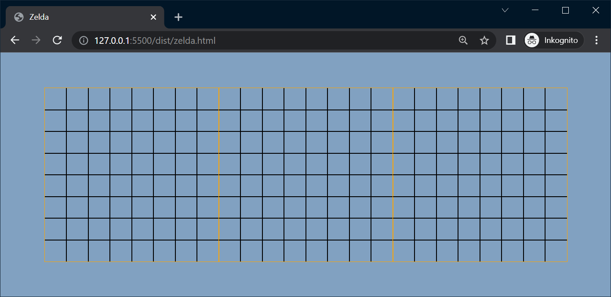
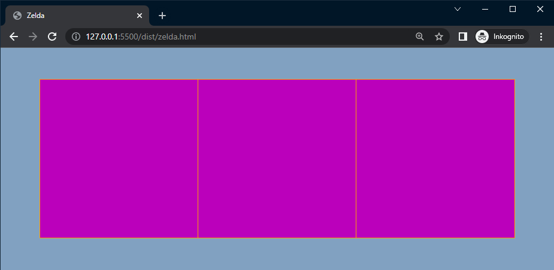
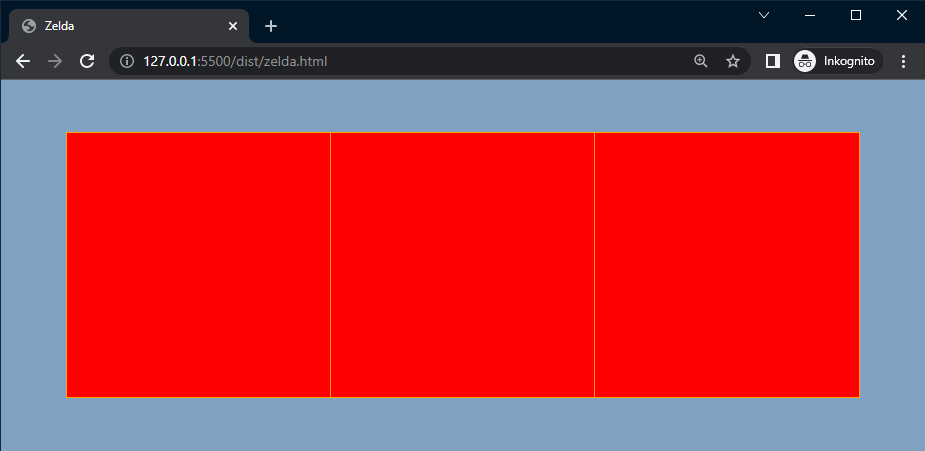
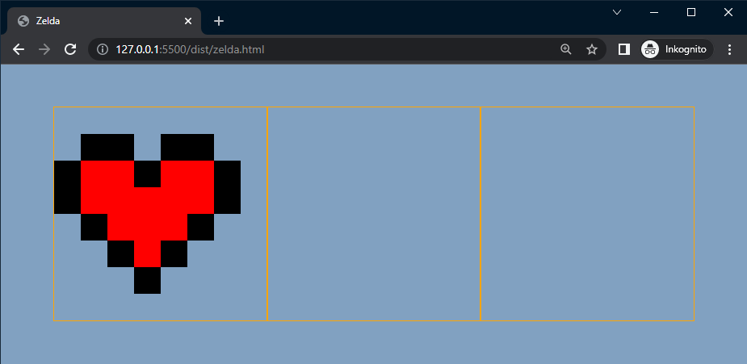
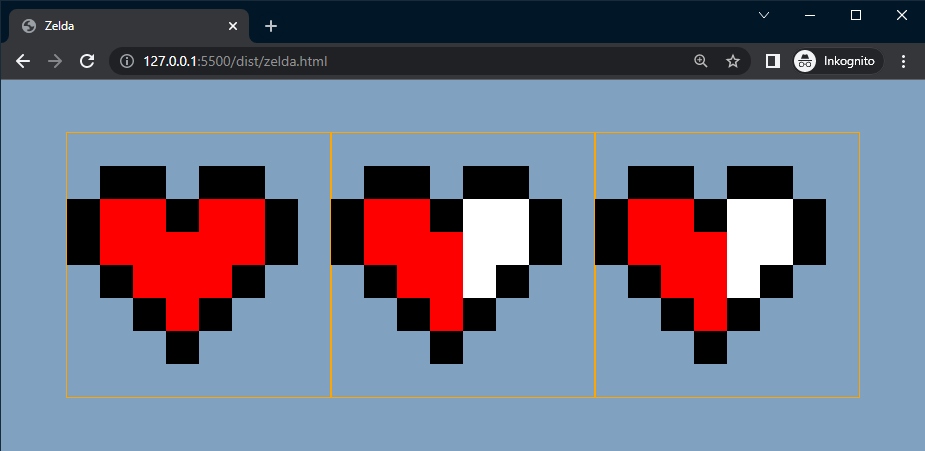

# Att skapa ett hjärta - <br> Den avancerade vägen

## Webbutveckling 2

---

# Vad ska vi skapa?


---

# HTML-koden

```html []
<div class="life">
  <div class="heart heart__one">
    <div class="px"></div> <!-- 64 -->
     ...
  </div>
  <div class="heart heart__two">
    <div class="px"></div> <!-- 64 -->
    ...
  </div>
  <div class="heart heart__three">
    <div class="px"></div> <!-- 64 -->
    ...
  </div>
<div>
```

---

# SCSS

--

## scss/partials/_sizes.scss

```scss []
// Zelda
$px-size: 30px;
```

--

## scss/partials/_colors.scss

```scss []
// Zelda
$heart-red: red;
$heart-black: black;
$heart-white: white;
```

--

## scss/zelda.scss

```scss []
@use 'base/' as *;
@use 'partials/' as *;

.life {
  display: flex;
}

.heart {
  outline: 1px solid orange;
  display: flex;
  flex-wrap: wrap;
  width: calc($px-size * 8);
}

.px { //Temporär selektor
  width: $px-size;
  height: $px-size;
  outline: 1px solid black;
}
```

--



--

## scss/partials/_mixins.scss

```scss []
@use 'sizes' as *;
@use 'colors' as *;

@mixin heartpixelcolors () {
  .px {
    background-color: #b0b;
    width: $px-size;
    height: $px-size;
  }
}
```


--

## scss/zelda.scss

```scss [6]
.heart {
  outline: 1px solid orange;
  display: flex;
  flex-wrap: wrap;
  width: calc($px-size * 8);
  @include heartpixelcolors();
}
```

  Radera även regeln **.px** från **scss/zelda.scss**

--



--

## scss/partials/_mixins.scss

```scss [2-7, 10]
@mixin heartpixelcolors () {
  $heart-colors: (
    t: transparent,
    g: $heart-black,
    r: $heart-red,
    w: $heart-white
  );

  .px {
    background-color: map-get($map: $heart-colors, $key: 'r' );
    width: $px-size;
    height: $px-size;
  }
}
```

--



--

## scss/partials/_maps.scss

```scss []
$heart-one:
"t", "t", "t", "t", "t", "t", "t", "t",
"t", "g", "g", "t", "g", "g", "t", "t",
"g", "r", "r", "g", "r", "r", "g", "t",
"g", "r", "r", "r", "r", "r", "g", "t",
"t", "g", "r", "r", "r", "g", "t", "t",
"t", "t", "g", "r", "g", "t", "t", "t",
"t", "t", "t", "g", "t", "t", "t", "t",
"t", "t", "t", "t", "t", "t", "t", "t";
```

--

## scss/partials/_index.scss

```scss [2]
@forward '../partials/colors';
@forward '../partials/maps';
@forward '../partials/mixins';
@forward '../partials/sizes';
```

--

## scss/partials/_mixins.scss

```scss []
@mixin heartpixelcolors ($heart-map) {
  $heart-colors: (
    t: transparent,
    g: $heart-black,
    r: $heart-red,
    w: $heart-white
  );

  $num: 1;

  @each $value in $heart-map {
    .px:nth-child(#{$num}) {
      background-color: map-get($map: $heart-colors, $key: $value );
    }
    $num: $num + 1;
  }

  .px {
    width: $px-size;
    height: $px-size;
  }
}
```

--

## scss/zelda.scss

```scss [8-10]
.heart {
  outline: 1px solid orange;
  display: flex;
  flex-wrap: wrap;

  width: calc($px-size * 8);

  &__one {
    @include heartpixelcolors($heart-one);
  }
}
```

--



--

## scss/partials/_maps.scss

```scss []
$heart-two:
"t", "t", "t", "t", "t", "t", "t", "t",
"t", "g", "g", "t", "g", "g", "t", "t",
"g", "r", "r", "g", "w", "w", "g", "t",
"g", "r", "r", "r", "w", "w", "g", "t",
"t", "g", "r", "r", "w", "g", "t", "t",
"t", "t", "g", "r", "g", "t", "t", "t",
"t", "t", "t", "g", "t", "t", "t", "t",
"t", "t", "t", "t", "t", "t", "t", "t";

$heart-three:
"t", "t", "t", "t", "t", "t", "t", "t",
"t", "g", "g", "t", "g", "g", "t", "t",
"g", "r", "r", "g", "w", "w", "g", "t",
"g", "r", "r", "r", "w", "w", "g", "t",
"t", "g", "r", "r", "w", "g", "t", "t",
"t", "t", "g", "r", "g", "t", "t", "t",
"t", "t", "t", "g", "t", "t", "t", "t",
"t", "t", "t", "t", "t", "t", "t", "t";
```

--

## scss/zelda.scss

```scss [12-18]
.heart {
  outline: 1px solid orange;
  display: flex;
  flex-wrap: wrap;

  width: calc($px-size * 8);

  &__one {
    @include heartpixelcolors($heart-one);
  }

  &__two {
    @include heartpixelcolors($heart-two);
  }

  &__three {
    @include heartpixelcolors($heart-three);
  }
}
```

--



---

# SLUT!