# SASS

## Webbutveckling 2

---

# Centralt innehåll

Språk med stöd för variabler för att förenkla CSS-generering.

---

# Sass?

--

Sass är CSS-preprocessor vilket innebär att vi kodar formatmallarna i språket **sass/scss** för att sedan via någon tjänst konvertera till vanlig css.

--

När man pratar om **sass** så menar de flesta egentligen **scss**.

I **sass** (som kom först) har man tagit bort anvädningen av klammerparenteser.

I **scss** använder man klammerparenteser som vi är vana med, så när vi pratar om **sass** så menar vi **scss**.

--

## Sass

```scss
$font-size: 18px;
$text-color: #000;

html
    font-size: $font-size;
    color: $text-color;

```

--

## Scss

```scss
$font-size: 18px;
$text-color: #000;

html {
    font-size: $font-size;
    color: $text-color;
}
```

---

# Installation

---

# Node.js

--

Hämta hem **node.js** från [https://nodejs.org/en/](https://nodejs.org/en/).

--

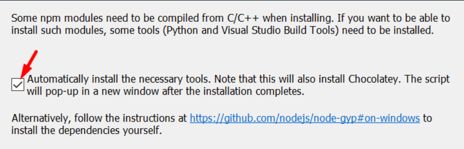

Under installationen ser du till att bocka i rutan för att installera nödvändiga verktyg.

--

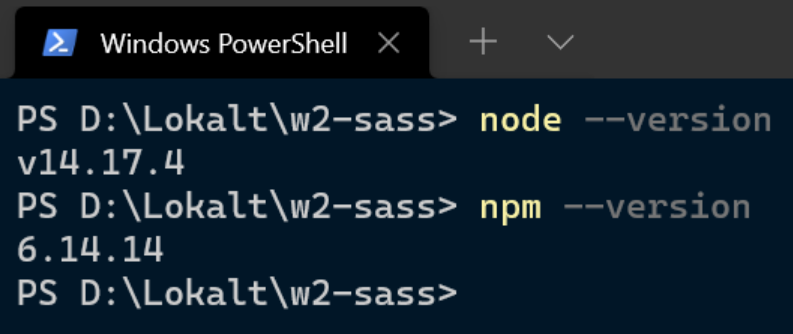

När installationen är klar kontrollerar du att **node** och **npm** (_Node Package Manager_) finns.

---

# Sätta upp projektet

--

1. Skapa förvaringsplats
1. Klona ner
1. Initiera projektet
1. Installera moduler - sass
1. Kontroll - sass
1. Installera moduler - parcel
1. Kontroll - parcel
1. Gitignore
1. Pusha

---

## Skapa förvaringsplats

Skapa en ny privat förvaringsplats med namnet **w2-sass**.

Glöm inte att bjuda in läraren!

---

## Klona ner

```text
git clone https://github.com/swewebb/w2-sass.git
```

Klona ner förvaringsplatsen i mappen **C:\git**

---

## Initiera projektet

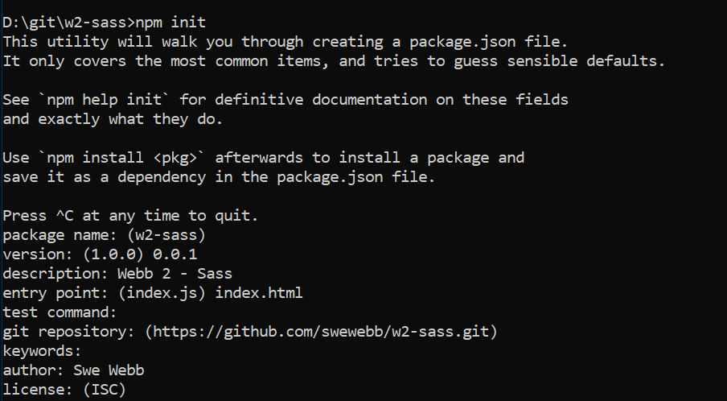

--

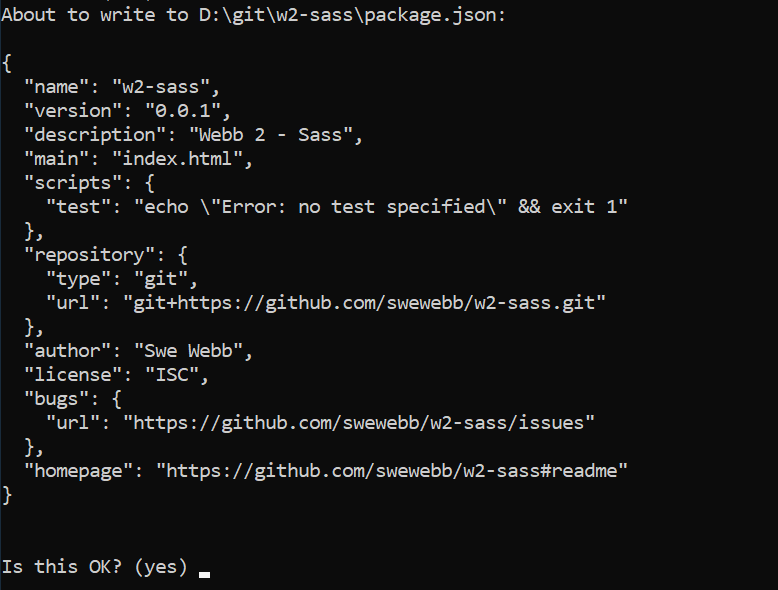

--

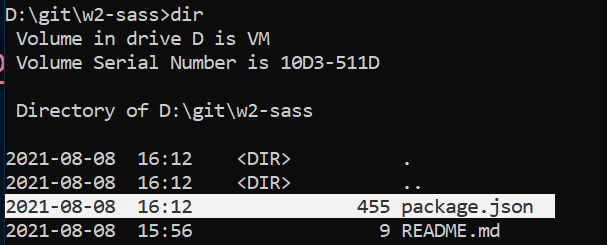

--

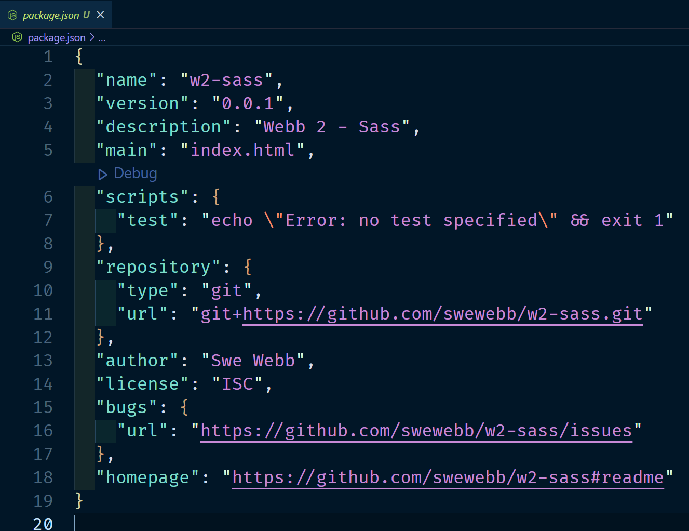

---

## Installera moduler - Sass

```
npm install sass -g
npm install sass -D
```

---

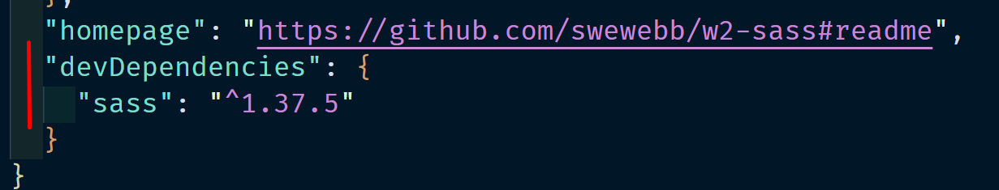

---

## Kontroll - Sass

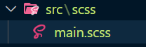

--

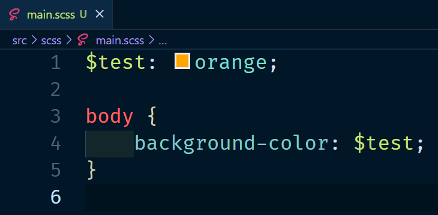

--

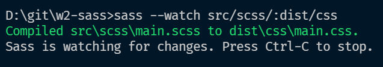

--

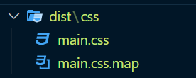

--

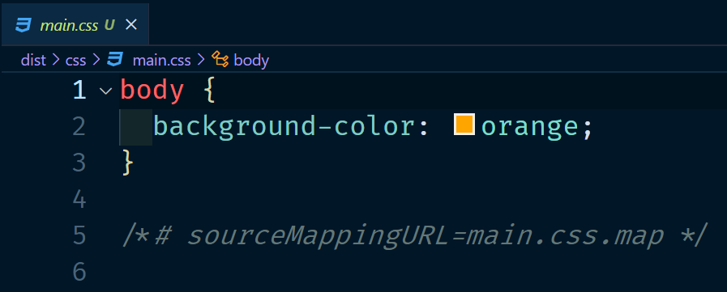

---

## Installera moduler - Parcel

```
npm install parcel-bundler -D
```

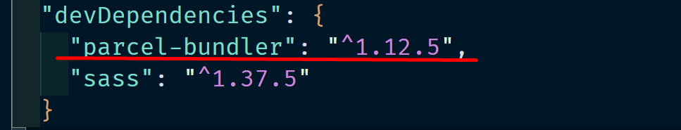

--

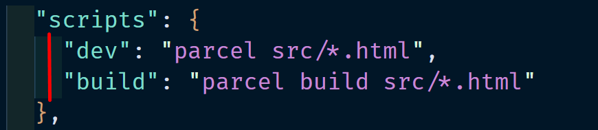


---

## Kontroll - Parcel

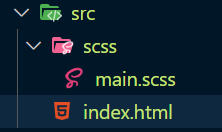

--

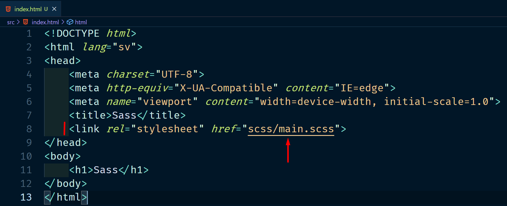

--

```
npm run dev
```

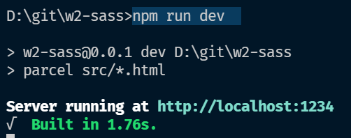

--

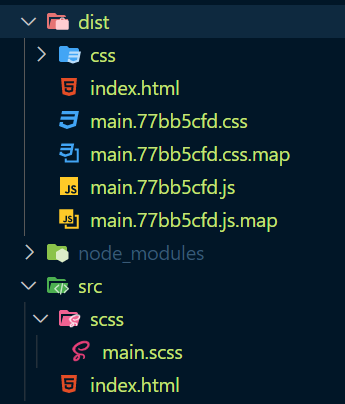

--

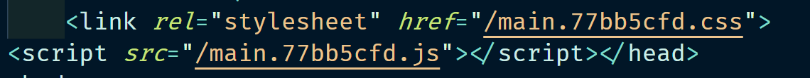

---

## .gitignore

I den här filen lägger vi till sådant som INTE ska hanteras av Git.

**Observera!** Filen heter **.gitignore**

```
node_modules
.cache
```

---

## Pusha

Pusha upp allt till GitHub.

---

# Länkar

- [https://nodesource.com/blog/an-absolute-beginners-guide-to-using-npm/](https://nodesource.com/blog/an-absolute-beginners-guide-to-using-npm/)
- [https://parceljs.org/getting_started.html](https://parceljs.org/getting_started.html)

---

# SLUT!
