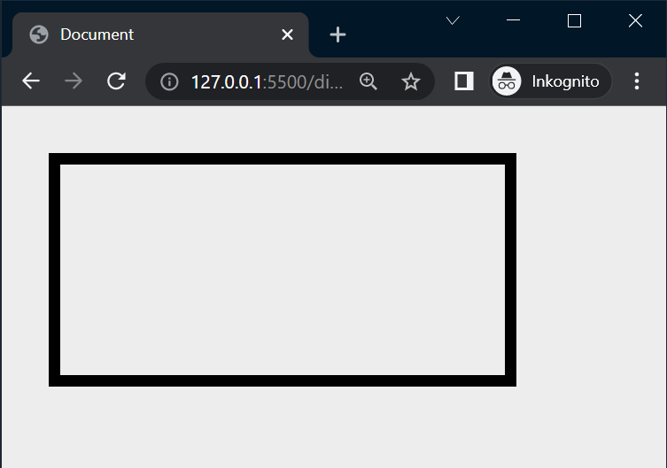
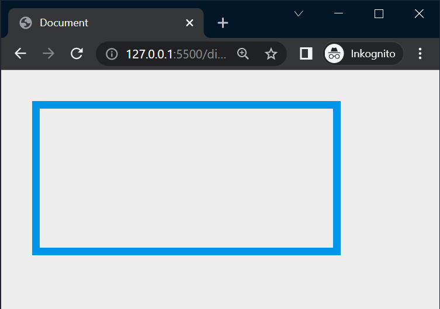
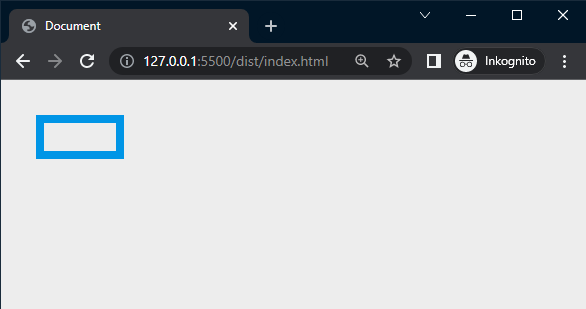
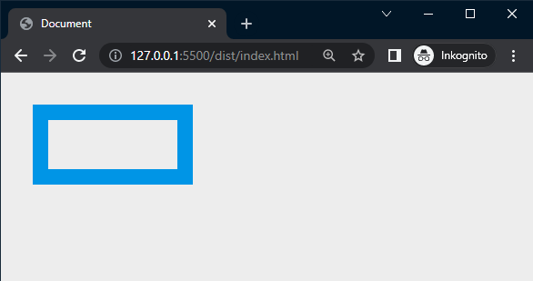

# Mixins

## Webbutveckling 2

---

# Mixins

--

**Mixins** kan vi använda oss av för att kunna återanvända en gruppering av CSS-regler.

--

# Demo

--

## src/index.html

```html
<div class="demo"></div>
```

--

## src/mixins/_demo.scss

```scss []
@mixin test() {
  border: .5rem solid #000;

  width: 20rem;
  aspect-ratio: 2/1;

  margin: 2rem;
}
```

Vi skapar en mixin genom att ange nyckelordet **@mixin**.

--

## src/style.scss

```scss [3, 6]
@use 'base/' as *;
@use 'partials/' as *;
@use 'mixins/demo';

.demo {
  @include demo.test()
}
```

Här har vi importerat vår fil med vår mixin för att sedan inkludera den.

--



--

## src/mixins/_demo.scss

```scss [1, 4]
@use '../partials/colors' as c;

@mixin test() {
  border: .5rem solid c.$secondary-color;

  width: 20rem;
  aspect-ratio: 2/1;

  margin: 2rem;
}
```

--



--

## src/mixins/_demo.scss

```scss [3-4, 6]
@use '../partials/colors' as c;

@mixin test($w, $b: .5rem) {
  border: $b solid c.$secondary-color;

  width: $w;
  aspect-ratio: 2/1;

  margin: 2rem;
}
```

--

## src/style.scss

```scss [3, 6]
@use 'base/' as *;
@use 'partials/' as *;
@use 'mixins/demo';

.demo {
  @include demo.test(5rem);
}
```

--



--

## src/style.scss

```scss [3, 6]
@use 'base/' as *;
@use 'partials/' as *;
@use 'mixins/demo';

.demo {
  @include demo.test(10rem, 1rem);
}
```

--



--

## src/mixins/_demo.scss

```scss [1, 3-4]
//@use '../partials/colors' as c;

@mixin test($w, $c, $b: .5rem) {
  border: $b solid $c;

  width: $w;
  aspect-ratio: 2/1;

  margin: 2rem;
}
```

--

## src/style.scss

```scss [3, 6]
@use 'base/' as *;
@use 'partials/' as *;
@use 'mixins/demo';

.demo {
  @include demo.test(10rem, $primary-color, 1rem);
}
```

--


---

# Länkar

--

* [Sass Tutorial 4 - @mixins in sass](https://www.youtube.com/watch?v=zlxcjVn6xEg)
* [Sass Tutorial 5 - Mixin arguments everything you need to know](https://www.youtube.com/watch?v=CMan2craSag)

---

# SLUT!
