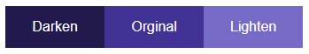
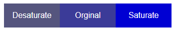
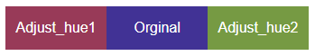

# Färger

## Webbutveckling 2

---

# Färger

--

I sass finns det inbyggda funktioner för att hantera/justera färger.

---

# Darken och lighten

--

  Med **darken** och **lighten** kan vi göra en nyans mörkare eller ljusare (duh!). Värdet vi anger kan vara mellan 0-100%.

--

```scss []
$primary-color: #3b3b98;

.orginal {
    background-color: $primary-color;
}

.darken {
    background-color: darken($primary-color, 20%);
}

.lighten {
    background-color: lighten($primary-color, 20%);
}
```

--



---

# Saturate och desaturate

--
  Med **saturate** gör man aktuell nyans mer mättad och värdet vi anger kan vara mellan 0-100%.

  Med **desaturate** gör man aktuell nyans mindre mättad och värdet vi anger kan vara mellan 0-100%.

--

```scss []
$primary-color: #3b3b98;

.orginal {
    background-color: $primary-color;
}

.saturate {
    background-color: saturate($primary-color, 100%);
}

.desaturate {
    background-color: desaturate($primary-color, 25%);
}
```

--



---

# Adjust-hue

Med **adjust-hue** förflyttar man sig från en nyans till en annan i [HSL-hjulet](https://tallys.github.io/color-theory/).

Man anger ett gradantal mellan -360 - 360.

--

```scss []
$primary-color: #3b3b98;

.orginal {
    background-color: $primary-color;
}

.adjusthue1 {
    background-color: adjust_hue($primary-color, 100deg);
}

.adjusthue2 {
    background-color: adjust_hue($primary-color, 200deg);
}
```

--



---

# Länkar

* [SASS Färghantering](https://www.youtube.com/watch?v=xnVCGrBQ3NQ)
* [SassMe](https://sassme.jim-nielsen.com/)
* [Sass Color Generator](http://scg.ar-ch.org/)
* [chromatichq](https://chromatichq.com/insights/understanding-and-using-hsl-your-css)
* [tutorialsteacher](https://www.tutorialsteacher.com/sass/sass-color-functions)

---

# SLUT!
