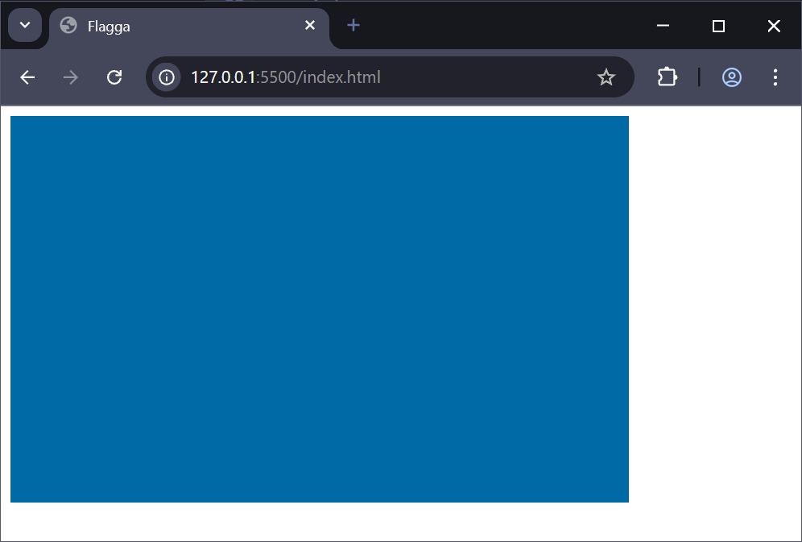
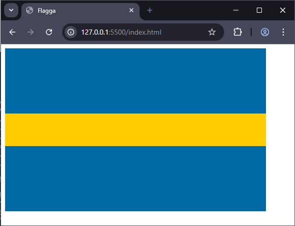

# SASS

## Webbutveckling 2

---

# Centralt innehåll

Språk med stöd för variabler för att förenkla CSS-generering.

---

# Sass?

--

Sass är CSS-preprocessor vilket innebär att vi kodar formatmallarna i språket **sass/scss** för att sedan via någon tjänst konvertera till vanlig css.

--

## Sass

```scss []
$font-size: 18px;
$text-color: #000;

html
    font-size: $font-size;
    color: $text-color;

```

I **sass** (som kom först) har man tagit bort anvädningen av klammerparenteser.

--

## Scss

```scss []
$font-size: 18px;
$text-color: #000;

html {
  font-size: $font-size;
  color: $text-color;
}
```

I **scss** (vilket är den version vi kommner använda) använder man klammerparenteser som vi är vana med, så när vi pratar om **sass** så menar vi **scss**.

---

# Använda tillägg i VSC

--

Installera **Live Sass Compiler** som _Glenn Marks_ har skrivit.

---

# Exempel 1

--

## Mappar och filer

```text [ ]
/
  partials/
    _variables.scss
  index.html
  main.scss
```

scss-filer som börjar med ett understreck kommer inte att kompileras

--

## index.html

```html [7,11]
<!DOCTYPE html>
<html lang="sv">
  <head>
    <meta charset="UTF-8" />
    <meta name="viewport" content="width=device-width, initial-scale=1.0" />
    <title>Flagga</title>
    <link rel="stylesheet" href="main.css" />
  </head>

  <body>
    <div class="flag"></div>
  </body>
</html>
```

--

## \_variables.scss

```scss []
// Colors
$clr-primary: #006aa7;
$clr-secondary: #fecc00;

// Scale
$scale: 2rem;
```

--

När det gäller att namge variabler följer vi dessa regler:

- Börjar alltid med $-tecken
- Enbart små bokstäver (a-z, 0-9)
- Får inte börja med en siffra
- Vi använder bindestreck för uppdelning av namn.

--

## main.scss

```scss
@use "partials/variables" as var;

.flag {
  width: calc(var.$scale * 16);
  height: calc(var.$scale * 10);

  background: var.$clr-primary;
}
```

--

Starta nu scss-kompilatorn via **Watch Sass** och kolla resultatet i webbläsaren.

Nu ska du ha en **main.css** och en **main.css.map** fil.

Map-filen har vi för att via **Inspekteraren** visa var i SCSS:en koden finns.

--

# main.css

```css [ ]
.flag {
  width: 32rem;
  height: 20rem;
  background: #006aa7;
} /*# sourceMappingURL=main.css.map */
```

--



--

## main.scss

```scss [9-21]
@use "partials/variables" as var;

.flag {
  width: calc(var.$scale * 16);
  height: calc(var.$scale * 10);

  background: var.$clr-primary;

  position: relative;

  &::before {
    content: "";

    position: absolute;
    top: var.$scale * 4;

    width: 100%;
    height: var.$scale * 2;

    background: var.$clr-secondary;
  }
}
```

--

# main.css

```css [ ]
.flag {
  width: 32rem;
  height: 20rem;
  background: #006aa7;
  position: relative;
}
.flag::before {
  content: "";
  position: absolute;
  top: 8rem;
  width: 100%;
  height: 4rem;
  background: #fecc00;
} /*# sourceMappingURL=main.css.map */
```

--



--

## main.scss

```scss [23-33]
@use "partials/variables" as var;

.flag {
  width: calc(var.$scale * 16);
  height: calc(var.$scale * 10);

  background: var.$clr-primary;

  position: relative;

  &::before {
    content: "";

    position: absolute;
    top: var.$scale * 4;

    width: 100%;
    height: var.$scale * 2;

    background: var.$clr-secondary;
  }

  &::after {
    content: "";

    position: absolute;
    left: var.$scale * 5;

    width: var.$scale * 2;
    height: 100%;

    background: var.$clr-secondary;
  }
}
```

--

## main.css

```css [ ]
.flag {
  width: 32rem;
  height: 20rem;
  background: #006aa7;
  position: relative;
}
.flag::before {
  content: "";
  position: absolute;
  top: 8rem;
  width: 100%;
  height: 4rem;
  background: #fecc00;
}
.flag::after {
  content: "";
  position: absolute;
  left: 10rem;
  width: 4rem;
  height: 100%;
  background: #fecc00;
} /*# sourceMappingURL=main.css.map */
```

--


---

# Exempel 2

--

Vi fortsätter på koden från **Exempel 1**.

--

## Mappar och filer

```text [3]
/
  partials/
    _index.scss
    _variables.scss
  index.html
  main.scss
```

--

## \_index.scss

```scss [ ]
@forward "partials/variables" as v-*;
```

--

## main.scss

```scss [ ]
@use "partials/" as *;

.flag {
  width: calc($v-scale * 16);
  height: calc($v-scale * 10);

  background: $v-clr-primary;

  position: relative;

  &::before {
    content: "";

    position: absolute;
    top: $v-scale * 4;

    width: 100%;
    height: $v-scale * 2;

    background: $v-clr-secondary;
  }
  &::after {
    content: "";

    position: absolute;
    left: $v-scale * 5;

    width: $v-scale * 2;
    height: 100%;

    background: $v-clr-secondary;
  }
}
```

---

# Exempel 3

--

Vi fortsätter på koden från **Exempel 2**.

--

## Mappar och filer

```text [4]
/
  partials/
    _index.scss
    _mixins.scss
    _variables.scss
  index.html
  main.scss
```

--

## \_index.scss

```scss [2]
@forward "variables" as v-*;
@forward "mixins" as mx-*;
```

--

## \_mixins.scss

```scss [ ]
@mixin flag($sz, $clr-one, $clr-two) {
  // Empty
}
```

--

```scss [ ]
@mixin flag($sz, $clr-one, $clr-two) {
  width: calc($sz * 16);
  height: calc($sz * 10);

  background: $clr-one;

  position: relative;

  &::before {
    content: "";

    position: absolute;
    top: $sz * 4;

    width: 100%;
    height: $sz * 2;

    background: $clr-two;
  }
  &::after {
    content: "";

    position: absolute;
    left: $sz * 5;

    width: $sz * 2;
    height: 100%;

    background: $clr-two;
  }
}
```

--

## main.scss

```scss [ ]
@use "partials/" as *;

.flag {
  @include mx-flag($v-scale, $v-clr-primary, $v-clr-secondary);
}
```

---

# Sammanfattning

--

## Partials

En partial är en SCSS-fil som börjar med understreck t.ex. **\_variables.scss**

Kompileras inte direkt till CSS

Används för att dela upp koden i moduler

--

## @use

Importerar kod från andra SCSS-filer

Namnrymder för att undvika krockar

--

## @forward

Används i **\_index.scss:er** för att skicka vidare variabler, mixins, funktioner

Gör det lättare att samla ihop flera partials

--

### Utan namespace

```scss [ ]
@forward "variables";
@forward "mixins";
```

```scss [ ]
.flag {
  @include flag($scale, $clr-primary, $clr-secondary);
}
```

--

## Med namespace

```scss [ ]
@forward "variables" as v-*;
@forward "mixins" as mx-*;
```

```scss [ ]
.flag {
  @include mx-flag($v-scale, $v-clr-primary, $v-clr-secondary);
}
```

--

## @mixin

En **mixin** är som en funktion för SCSS

Återanvänder kodblock med parametrar

Används med @include när man vill använda en mixin

---

# Slut!
