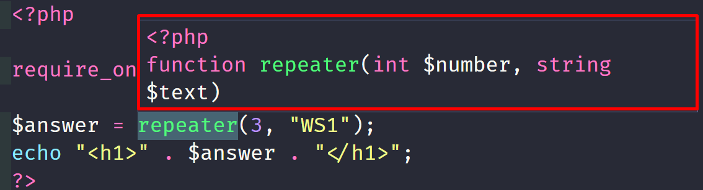
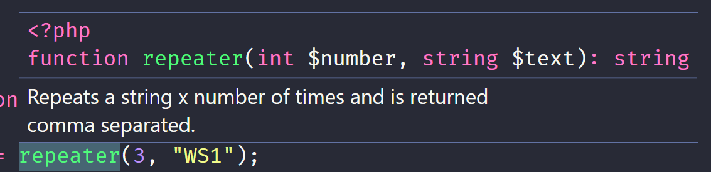

# Funktioner

---

# Uppbyggnad

```php
// Funktionshuvud
function namn()
{
  // Funktionskropp
}

namn() // Funktionsanrop
```

---

# Placering

--

Alla funktioner ska ligga i en separat fil som vi sedan inkluderar.

Filen ska inte innehålla HTML-templaten, utan ska börja med start-taggen för php följt av en tom rad och sluta med en tom rad.

--

## functions.php

```php
<?php

//Här skriver du dina funktioner


```

--

## Inkludera funktionsfilen

```php
include "functions.php";
include_once "functions.php";
require "functions.php";
require_once "functions.php";
```

Fyra olika sätt.

_There is one big difference between include and require; when a file is included with the include statement and PHP cannot find it, the script will continue to execute_

--

## Exempel

```php
function area()
{
    $a = 5;
    $b = 3;
    $area = $a * $b;

    echo "<p>$area</p>";
}
```

```php
require_once "functions.php";

area();
```

```
15
```

---

# Variable Scope

--

## Lokala variabler

En variabel inuti en funktion kan bara nås inuti funktionen, dvs den lever bara där.

--

## Global variabel

En variabel deklarerad utanför en funktion är **global** och kan nås överallt, utom från insidan av en funktion.

Om vi verkligen måste så kan vi komma åt en global variabel inuti en funktion genom att skriva **global** före namnet på variabeln vi vill nå inuti funktionen.

--

```php
$message = 'Hello';

function say()
{
	global $message;
	echo $message; // Hello
}

say();
```

--

# Statiska variabler

**Statiska** variabler behåller sitt värde mellan funktionsanrop.

```php
function get_counter() {
    static $counter = 1;
    return $counter++;
}

echo get_counter() .  '<br>'; // 1
echo get_counter() .  '<br>'; // 2
echo get_counter() .  '<br>'; // 3
```

--

## Superglobal variabler

Globala variabler som är inbyggda i PHP, t.ex **$_POST** och **\$_GET**.

Dessa kan man nå överallt.

---

# Utan eller med return

--

Vi kan ha funktioner som inte returnerar något och funktioner som returnerar data.

--

## Utan return

```php
function area()
{
    $a = 5;
    $b = 3;
    $area = $a * $b;

    echo "<p>$area</p>";
}
```

```php
require_once "functions.php";

area();
```

```
15
```

--

## Med return

```php
function area()
{
    $a = 5;
    $b = 3;

    return $a * $b;
}
```

```php
require_once "functions.php";

$answer = area();
echo "<h1>" . $answer . "</h1>";
```

```
15
```

---

# Parametrar och argument

--

```php
function area($a, $b)
{
    return $a * $b;
}
```

Innanför () = Argument

--

```php
require_once "functions.php";

$answer = area(5, 6);
echo "<h1>" . $answer . "</h1>";
```

Innanför () = Parametrar

---

# Standardvärde

--

```php [1]
function area($a, $b = 10)
{
    return $a * $b;
}
```

Ska alltid ligga sist i argumentlistan.

Självklart kan man ha standardvärden på alla argument.

--

```php [3]
require_once "functions.php";

$answer = area(5);
echo "<h1>" . $answer . "</h1>";
```

```html
50
```

--

```php [3]
require_once "functions.php";

$answer = area(5, 5);
echo "<h1>" . $answer . "</h1>";
```

```html
25
```

---

# "Hårda" funktioner

--

Vi kan (läs ska) förbättra våra funktioner genom att göra dem "hårda".

Det menas att vi anger vilken typ av data vi förväntar oss i argumentlistan.

--

```php
function repeater($number, $text)
{
    $arr = [];
    for ($i = 0; $i < $number; $i++) {
        $arr[] = $text;
    }
    return implode(", ", $arr);
}
```

```php [2]
require_once "functions.php";
$answer = repeater(5, "WS1");
echo "<h1>" . $answer . "</h1>";
```

```html
WS1, WS1, WS1, WS1, WS1
```

--

```php
function repeater($number, $text)
{
    $arr = [];
    for ($i = 0; $i < $number; $i++) {
        $arr[] = $text;
    }
    return implode(", ", $arr);
}
```

```php [2]
require_once "functions.php";
$answer = repeater("WS1", 5);
echo "<h1>" . $answer . "</h1>";
```

```html
Fatal error: Allowed memory size of 536870912 bytes exhausted (tried to allocate 536870920 bytes) in C:\xampp\htdocs\ws1\funktioner\functions.php on line 21
```

--

```php [3, 5]
<?php

declare(strict_types=1);

function repeater(int $number, string $text)
{
    $arr = [];

    for ($i = 0; $i < $number; $i++) {
        $arr[] = $text;
    }

    return implode(", ", $arr);
}
```

Läs artiklarna [PHP strict_types](https://www.phptutorial.net/php-tutorial/php-strict_types/) och [PHP Type Hints](https://www.phptutorial.net/php-tutorial/php-type-hints/)

--



--

```php
$answer = repeater("WS1", 3);
```

```html
Fatal error: Uncaught TypeError: repeater(): Argument #1 ($number) must be of type int, string given, called in C:\xampp\htdocs\ws1\funktioner\index.php on line 14 and defined in C:\xampp\htdocs\ws1\funktioner\functions.php:5 Stack trace: #0 C:\xampp\htdocs\ws1\funktioner\index.php(14): repeater('WS1', 3) #1 {main} thrown in C:\xampp\htdocs\ws1\funktioner\functions.php on line 5
```

--

```php [5]
<?php

declare(strict_types=1);

function repeater(int $number, string $text): string
{
    $arr = [];

    for ($i = 0; $i < $number; $i++) {
        $arr[] = $text;
    }

    return implode(", ", $arr);
}
```

Vi kan även lägga till en **type hint** som beskriver vilken datatyp som funktionen returnerar.

Läs artikeln [PHP Type Hints](https://www.phptutorial.net/php-tutorial/php-type-hints/)

---

# Dokumentera funktioner

--

```php [5-11]
<?php

declare(strict_types=1);

/**
 * Repeats a string x number of times and is returned comma separated.
 *
 * @param integer $number
 * @param string $text
 * @return string
 */
function repeater(int $number, string $text): string
{
    $arr = [];

    for ($i = 0; $i < $number; $i++) {
        $arr[] = $text;
    }

    return implode(", ", $arr);
}

```

--



--

## PHP DocBlocker

Installera **PHP DocBlocker** i VSC.

För att skapa en grund för din dokumentation skriver du **/\*\*** och trycker enter.

