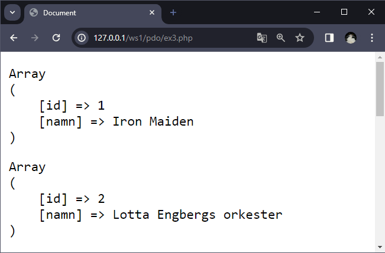
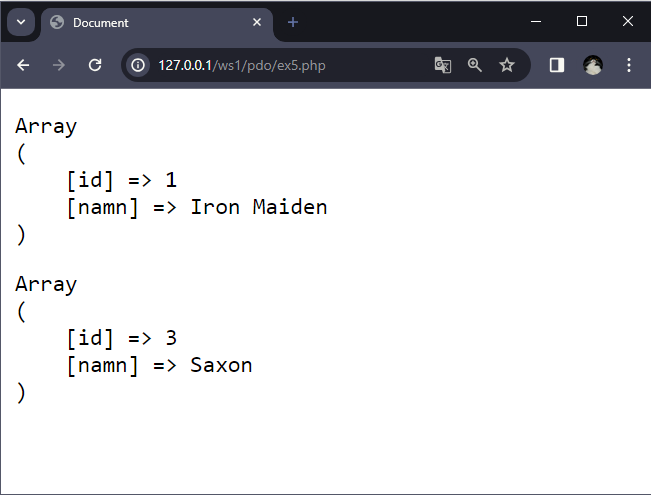
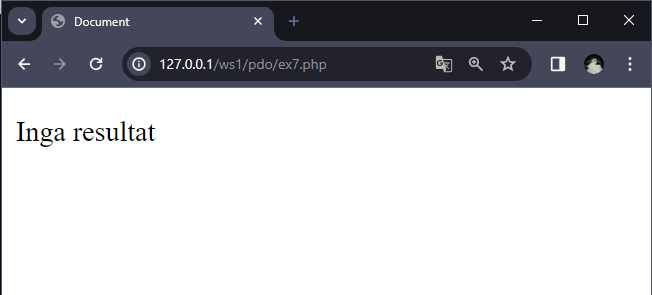

# PDO

--

PHP Data Object

Är ett **Database Access Abstraction Layer**, **DBAL** vilket gör det möjligt att kommunicera med olika typer av databaser.

--

Fördelar med att använda PDO:

**Säkerhet** - Användbara förberedda satser

**Användbarhet** - Många hjälpfunktioner för att automatisera rutinoperationer

**Återanvändbarhet** - Ett API för åtkomst till mängder av databaser, t.ex från SQLite, MySQL, Oracle

---

# Anslutning

--

```text []
mysql:host=localhost;dbname=demo;port=3306;charset=utf8mb4
```

Här används en **Data Source Name**, **DSN**

I DSN:en anges bland annat **database driver**, **host**, **db name** och **charset**

---

# connector.php

--

```php []
<?php


/**
 * PDO-connector
 *
 * @param [string] $host
 * @param [string] $db
 * @param [string] $user
 * @param [string] $pass
 * @param string $charset
 * @return pdo
 */
function connectToDb(): PDO
{
  $host = "127.0.0.1";
  $db = "demo";
  $user = "root";
  $pass = "hemligt";
  $charset = "utf8mb4";

  $dsn = "mysql:host=$host;dbname=$db;charset=$charset";
  $options = [
    PDO::ATTR_ERRMODE => PDO::ERRMODE_EXCEPTION,
    // PDO::ATTR_DEFAULT_FETCH_MODE => PDO::FETCH_ASSOC,
    // PDO::ATTR_EMULATE_PREPARES => false,
  ];

  try {
    $pdo = new PDO($dsn, $user, $pass, $options);
    return $pdo;
  } catch (PDOException $e) {
    throw new PDOException("Connection failed: " . $e->getMessage());
  }
}
```

--

Här skapas ett **PDO-objekt** genom att använda **DSN-strängen** och anslutningsuppgifterna, tillsammans med de alternativ som definierats.

**PDO-objekt** kommer att användas för att utföra SQL-satser mot databasen.

---

# Testar anslutaren

--

```php []
<?php
require_once 'functions/connector.php';

try {
  $pdo = connectToDb();
  echo "<p>Anslutningen gick bra.</p>";
} catch (PDOException $e) {
  echo "<p>Anslutning misslyckades: " . $e->getMessage() . "</p>";
}
?>
```

--

## Lyckad anslutning


--

## Misslyckad anslutning


---

# SQL utan variabler - Del 1

--

```php [5-18]
<?php
require_once 'functions/connector.php';

try {
  // Ansluter till databasen
  $pdo = connectToDb();

  $sql = "SELECT * FROM artister";

  // Förbered och kör SQL-frågan med PDO::query()
  $stmt = $pdo->query($sql);

  //Använder fetch() för att hämta en rad i taget
  while ($row = $stmt->fetch()) {
    echo "<pre>";
    print_r($row);
    echo "</pre>";
  }
} catch (PDOException $e) {
  echo "<p>Anslutning misslyckades: " . $e->getMessage() . "</p>";
}
?>
```

--


--

```php [3]
$options = [
  PDO::ATTR_ERRMODE => PDO::ERRMODE_EXCEPTION,
  PDO::ATTR_DEFAULT_FETCH_MODE => PDO::FETCH_ASSOC,
  // PDO::ATTR_EMULATE_PREPARES => false,
];
```

--


---

# SQL utan variabler - Del 2

--

```php [10-16]
<?php
require_once 'functions/connector.php';

try {
  $pdo = connectToDb();

  $sql = "SELECT * FROM artister";

  $stmt = $pdo->query($sql);
  $result = $stmt->fetchAll();

  foreach ($result as $row) {
    echo "<pre>";
    print_r($row);
    echo "</pre>";
  }
} catch (PDOException $e) {
  echo "<p>Anslutning misslyckades: " . $e->getMessage() . "</p>";
}
?>
```

--



---

# Prepared statements - Del 1

--

```php [7-9]
<?php
require_once 'functions/connector.php';

try {
  $pdo = connectToDb();

  $sql = "SELECT * FROM artister WHERE namn = ? OR namn = ?";
  $stmt = $pdo->prepare($sql);
  $stmt->execute(["iron maiden", "saxon"]);

  while ($row = $stmt->fetch()) {
    echo "<pre>";
    print_r($row);
    echo "</pre>";
  }
} catch (PDOException $e) {
  echo "<p>Anslutning misslyckades: " . $e->getMessage() . "</p>";
}
?>
```

--


---

# Prepared statements - Del 2

--

```php [7, 10]
<?php
require_once 'functions/connector.php';

try {
  $pdo = connectToDb();

  $sql = "SELECT * FROM artister WHERE namn = :n1 OR namn = :n2";

  $stmt = $pdo->prepare($sql);
  $stmt->execute(["n1" => "iron maiden", "n2" => "saxon"]);
  $res = $stmt->fetchAll();

  foreach ($res as $row) {
    echo "<pre>";
    print_r($row);
    echo "</pre>";
  }
} catch (PDOException $e) {
  echo "<p>Anslutning misslyckades: " . $e->getMessage() . "</p>";
}
?>
```

--



---

# Prepared statements - Del 3

--

```php [10, 13-21]
<?php
require_once 'functions/connector.php';

try {
  $pdo = connectToDb();

  $sql = "SELECT * FROM artister WHERE namn = :n1 OR namn = :n2";

  $stmt = $pdo->prepare($sql);
  $stmt->execute(["n1" => "saxon", "n2" => "def leppard"]);
  $res = $stmt->fetchAll();

  if ($res) {
    foreach ($res as $row) {
      echo "<pre>";
      print_r($row);
      echo "</pre>";
    }
  } else {
    echo "<p>Inga resultat</p>";
  }
} catch (PDOException $e) {
  echo "<p>Anslutning misslyckades: " . $e->getMessage() . "</p>";
}
?>
```

--


--

```php [10]
<?php
require_once 'functions/connector.php';

try {
  $pdo = connectToDb();

  $sql = "SELECT * FROM artister WHERE namn = :n1 OR namn = :n2";

  $stmt = $pdo->prepare($sql);
  $stmt->execute(["n1" => "helix", "n2" => "def leppard"]);
  $res = $stmt->fetchAll();

  if ($res) {
    foreach ($res as $row) {
      echo "<pre>";
      print_r($row);
      echo "</pre>";
    }
  } else {
    echo "<p>Inga resultat</p>";
  }
} catch (PDOException $e) {
  echo "<p>Anslutning misslyckades: " . $e->getMessage() . "</p>";
}
?>
```

--


---

# Like - Del 1

--

```php [7-12]
<?php
require_once 'functions/connector.php';

try {
  $pdo = connectToDb();

  $search = "%iron%";
  $sql = "SELECT * FROM artister WHERE namn LIKE :search";

  $stmt = $pdo->prepare($sql);
  $stmt->execute(["search" => $search]);
  $res = $stmt->fetchAll();

  if ($res) {
    foreach ($res as $row) {
      echo "<pre>";
      print_r($row);
      echo "</pre>";
    }
  } else {
    echo "<p>Inga resultat</p>";
  }
} catch (PDOException $e) {
  echo "<p>Anslutning misslyckades: " . $e->getMessage() . "</p>";
}
?>
```

--


--




---

# Like - Del 2

--

```php [7-11]
<?php
require_once 'functions/connector.php';

try {
  $pdo = connectToDb();

  $sql = "SELECT * FROM artister LIMIT :limitNr";

  $stmt = $pdo->prepare($sql);
  $stmt->execute(["limitNr" => 1]);
  $res = $stmt->fetchAll();

  foreach ($res as $row) {
    echo "<pre>";
    print_r($row);
    echo "</pre>";
  }
} catch (PDOException $e) {
  echo "<p>Anslutning misslyckades: " . $e->getMessage() . "</p>";
}
?>
```

--


--

```php [4]
$options = [
  PDO::ATTR_ERRMODE => PDO::ERRMODE_EXCEPTION,
  PDO::ATTR_DEFAULT_FETCH_MODE => PDO::FETCH_ASSOC,
  PDO::ATTR_EMULATE_PREPARES => false,
];
```

--


---

# Lägga till, uppdatera, radera

--

```php [7-15]
<?php
require_once 'functions/connector.php';

try {
  $pdo = connectToDb();

  $sql = "INSERT INTO artister (namn) VALUES (:namn)";

  $stmt = $pdo->prepare($sql);
  $stmt->execute(["namn" => "Dio"]);

  //Valfri - returnerar antalet rader som skrivits.
  $rowCount = $stmt->rowCount();

  echo "<p>Skrivningen gick bra. $rowCount rad skriven</p>";
} catch (PDOException $e) {
  echo "<p>Anslutning misslyckades: " . $e->getMessage() . "</p>";
}
?>
```

--


---

# Resurser

--

[(The only proper) PDO tutorial](https://phpdelusions.net/pdo)

[SELECT query with PDO](https://phpdelusions.net/pdo_examples/select)

[INSERT query with PDO](https://phpdelusions.net/pdo_examples/insert)

[UPDATE query with PDO](https://phpdelusions.net/pdo_examples/update)

---

# Uppgift

---

- Bygg upp en webbplats för bildatabasen.
- Se undersidor för krav för aktuell sida
- Är du "rostig" när det gäller CSS-grid så finns det ett startpaket att ladda ner på Classroom.

--

## index.php

- Visa senaste medlemmen
- Visa senaste bil och vem som äger den

--

## Alla medlemmar

- Lista alla medlemmar
- Lista alla medlemmar och hur många bilar de har

--

## Alla bilar med tillhörande ägare

- Lista alla bilar med tillhörande ägare

--

# Listning efter val

- Lista bilar efter valt fält
- Lista bilar efter valt fält, visa även ägare

--

# Sökning

- Visa resultatet för sökningen.

--

# Lägga till en medlem

- Kunna lägga till en medlem

--

# Lägga till en bil

- Kunna lägga till en bil
- Kunna lägga till en bil efter kontroll att den inte redan finns i databasen

--

# Ta bort en medlem

- Kunna ta bort en medlem
- Kunna ta bort en medlem och alla dess bilar

---

# Slut