# Array:er

--

Är en datatyp som beskriver en samling av värden.

Tre typer:

- Numerisk
- Associativ
- Multidimensionell (nåja)

---

# Numeriska array:er

--

## Olika sätt att skriva

--

### Alternativ 1

```php []
<?php

$garage[] = "Volvo P1800";
$garage[] = "Saab Sonett";
$garage[] = "De Tomaso Pantera";

echo "<pre>";
print_r($garage);
echo "</pre>";
```

--


[Nyckel] => Värde

--

### Alternativ 2

```php []
<?php

$garage = array(
  "Volvo P1800",
  "Saab Sonett",
  "De Tomaso Pantera"
);

echo "<pre>";
print_r($garage);
echo "</pre>";
```

--


--

### Alternativ 3

```php []
<?php

$garage = [
  "Volvo P1800",
  "Saab Sonett",
  "De Tomaso Pantera",
];

echo "<pre>";
print_r($garage);
echo "</pre>";
```

--

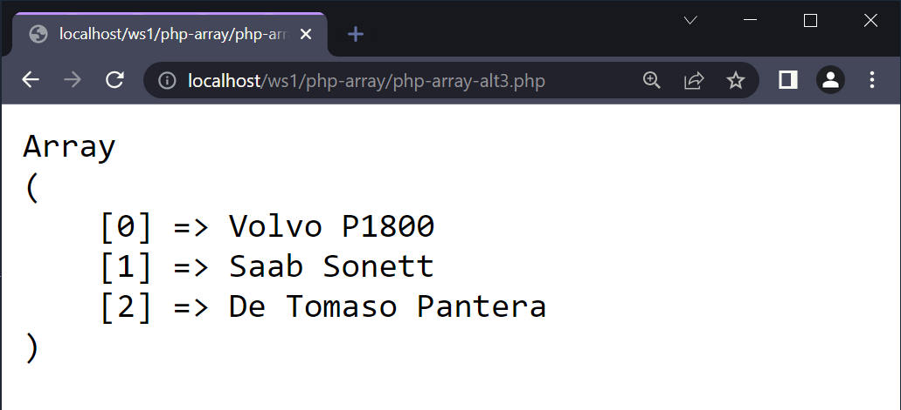

--

## Hämta från en numerisk array

--

```php [9]
<?php

$garage = [
  "Volvo P1800",
  "Saab Sonett",
  "De Tomaso Pantera",
];

echo "<p>" . $garage[1] . "</p>";
```

--

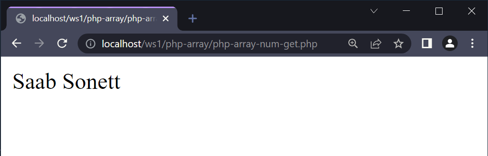

--

## Lägga till i en numerisk array

--

```php [9]
<?php

$garage = [
  "Volvo P1800",
  "Saab Sonett",
  "De Tomaso Pantera",
];

$garage[] = "Aston Martin DB9";

echo "<pre>";
print_r($garage);
echo "</pre>";
```

--

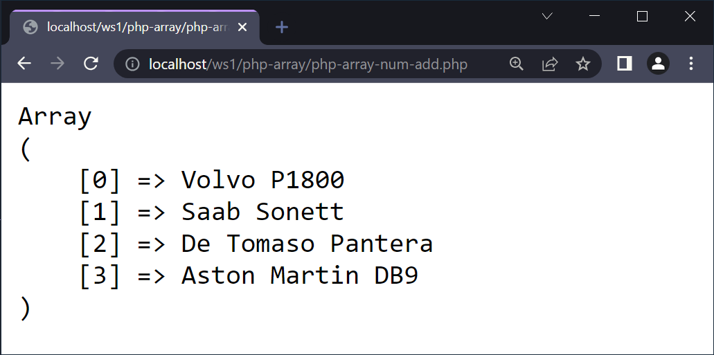

--

## Ta bort från en numerisk array

--

```php [9]
<?php

$garage = [
  "Volvo P1800",
  "Saab Sonett",
  "De Tomaso Pantera",
];

unset($garage[1]);

echo "<pre>";
print_r($garage);
echo "</pre>";
```

--

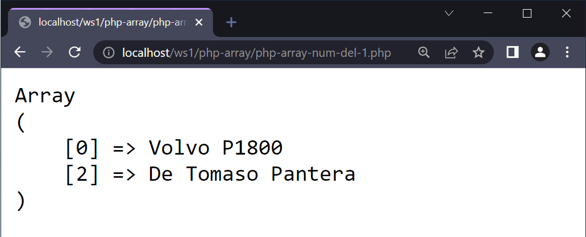

**Problem!** Varför är nyckelvärdena inte uppdaterade?

--

```php [9-11]
<?php

$garage = [
  "Volvo P1800",
  "Saab Sonett",
  "De Tomaso Pantera",
];

unset($garage[1]);
// Re-indexing
$garage= array_values($garage);

echo "<pre>";
print_r($garage);
echo "</pre>";
```

--


--

# Loopa ut

--

Se genomgången **Loopar**

--

## Sortera numeriska array:er

--

### Stigande sorterning

```php [9]
<?php

$garage = [
  "Volvo P1800",
  "Saab Sonett",
  "De Tomaso Pantera",
];

sort($garage);

echo "<pre>";
print_r($garage);
echo "</pre>";
```

--

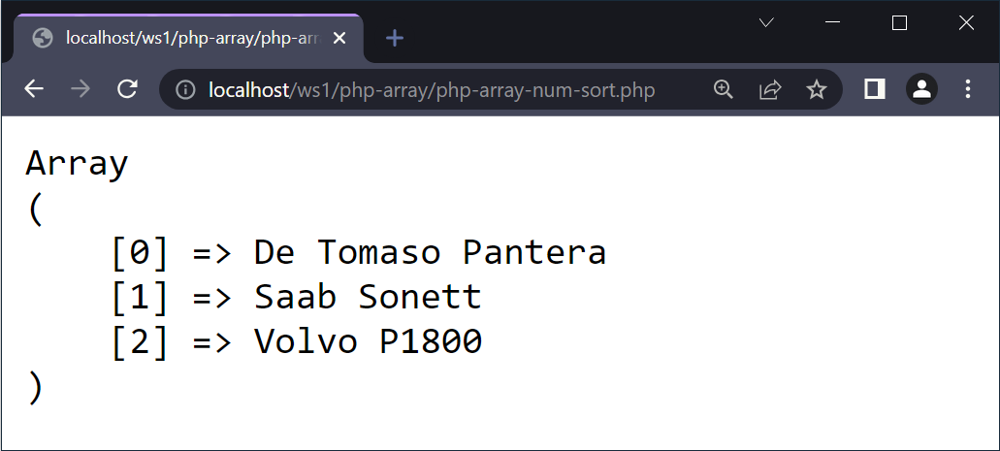

--

### Fallande sorterning

```php [9]
<?php

$garage = [
  "Volvo P1800",
  "De Tomaso Pantera",
  "Saab Sonett",
];

rsort($garage);

echo "<pre>";
print_r($garage);
echo "</pre>";
```

--

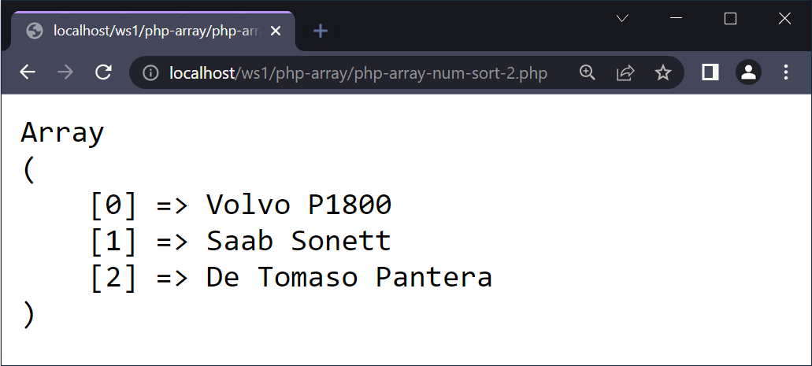

---

# Associativa array:er

--

## Olika sätt att skriva

--

### Alternativ 1

```php []
<?php

$garage["Bosse"] = "Volvo P1800";
$garage["Bengan"] = "Saab Sonett";
$garage["Bertil"] = "De Tomaso Pantera";

echo "<pre>";
print_r($garage);
echo "</pre>";
```

--


[Nyckel] => Värde

--

### Alternativ 2

```php []
<?php

$garage = array(
  "Bosse" => "Volvo P1800",
  "Bengan" => "Saab Sonett",
  "Bertil" => "De Tomaso Pantera"
);

echo "<pre>";
print_r($garage);
echo "</pre>";
```

--


--

### Alternativ 3

```php []
<?php

$garage = [
  "Bosse" => "Volvo P1800",
  "Bengan" => "Saab Sonett",
  "Bertil" => "De Tomaso Pantera",
];

echo "<pre>";
print_r($garage);
echo "</pre>";
```

--

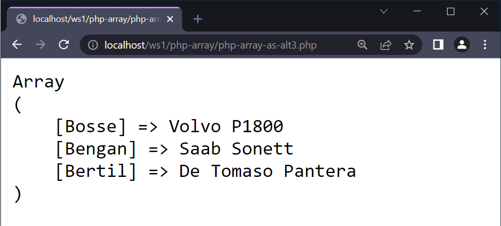

--

## Hämta från en associativ array

--

```php [9]
<?php

$garage = [
  "Bosse" => "Volvo P1800",
  "Bengan" => "Saab Sonett",
  "Bertil" => "De Tomaso Pantera",
];

echo "<p>" . $garage["Bengan"] . "</p>";
```

--

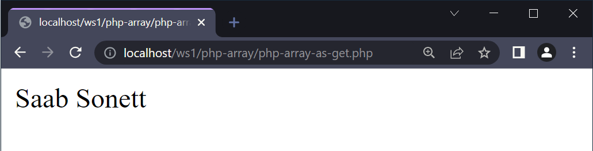

--

## Lägga till i en associativ array

--

```php [9]
<?php

$garage = [
  "Bosse" => "Volvo P1800",
  "Bengan" => "Saab Sonett",
  "Bertil" => "De Tomaso Pantera",
];

$garage["Bettan"] = "Aston Martin DB9";

echo "<pre>";
print_r($garage);
echo "</pre>";
```

--

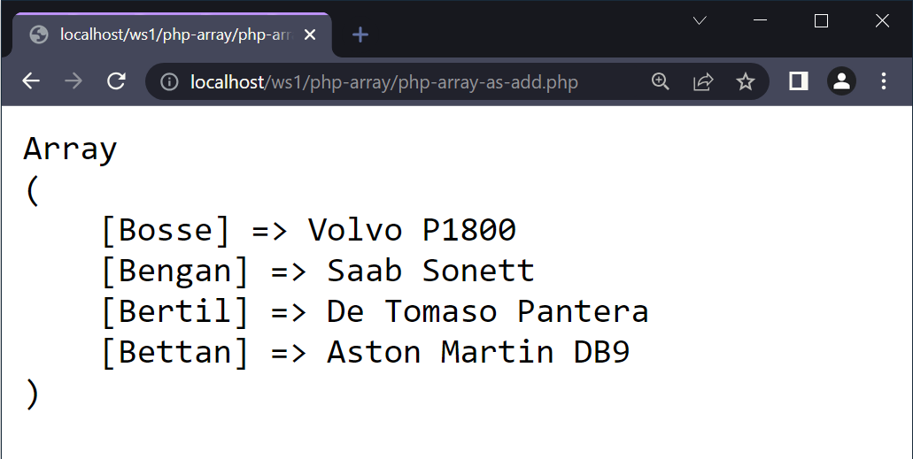

--

## Ta bort från en associativ array

--

```php [9]
<?php

$garage = [
  "Bosse" => "Volvo P1800",
  "Bengan" => "Saab Sonett",
  "Bertil" => "De Tomaso Pantera",
];

unset($garage["Bengan"]);

echo "<pre>";
print_r($garage);
echo "</pre>";
```

--

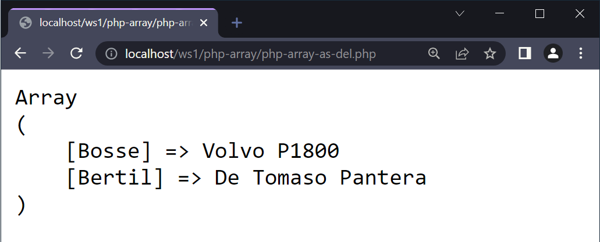

--

# Loopa ut

--

Se genomgången **Loopar**

--

## Sortera array:er

--

### Stigande sortering, värde

```php [7]
$garage = [
  "Bosse" => "Volvo P1800",
  "Bjarne" => "Saab Sonett",
  "Bertil" => "De Tomaso Pantera",
];

asort($garage);

echo "<pre>";
print_r($garage);
echo "</pre>";
```

--

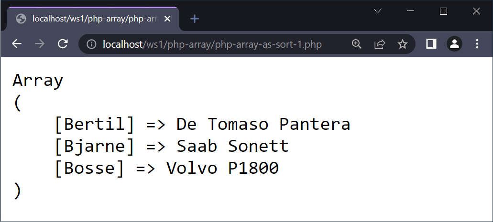

--

### Fallande sortering, värde

```php [7]
$garage = [
  "Bosse" => "Volvo P1800",
  "Bjarne" => "Saab Sonett",
  "Bertil" => "De Tomaso Pantera",
];

arsort($garage);

echo "<pre>";
print_r($garage);
echo "</pre>";
```

--


--

### Stigande sortering, nyckel

```php [7]
$garage = [
  "Bosse" => "Volvo P1800",
  "Bjarne" => "Saab Sonett",
  "Bertil" => "De Tomaso Pantera",
];

ksort($garage);

echo "<pre>";
print_r($garage);
echo "</pre>";
```

--

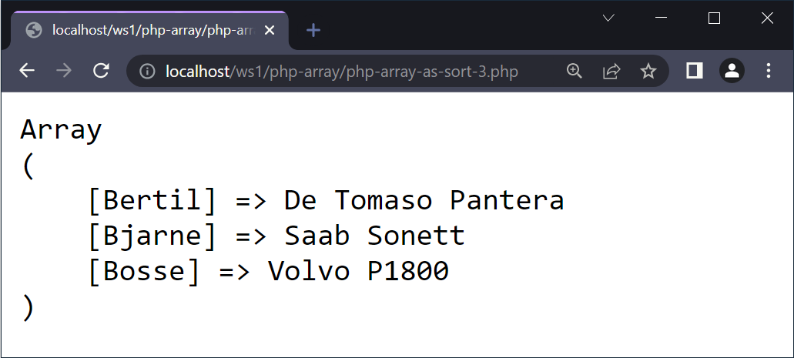

--

### Fallande sortering, nyckel

```php [7]
$garage = [
  "Bosse" => "Volvo P1800",
  "Bjarne" => "Saab Sonett",
  "Bertil" => "De Tomaso Pantera",
];

krsort($garage);

echo "<pre>";
print_r($garage);
echo "</pre>";
```

--

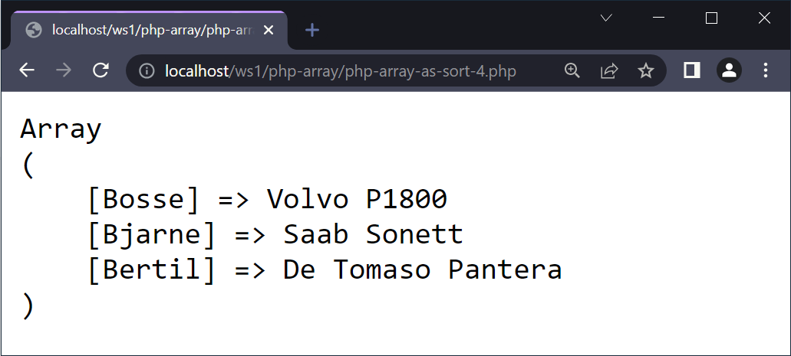

---

# Multidimensionella array:er

--

## Vad vill vi få för resultat?

--

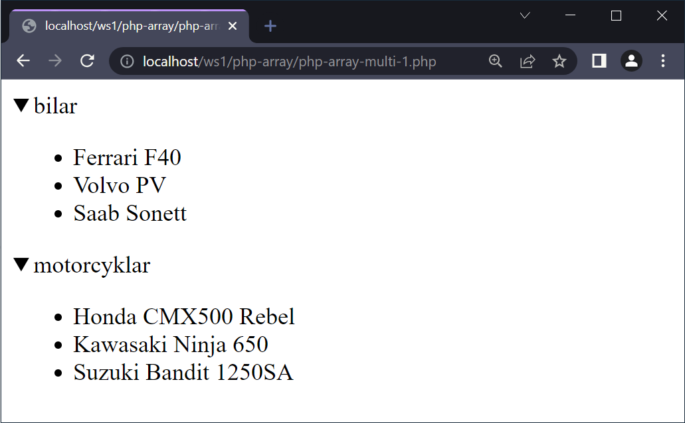

--

```html []
<details>
  <summary>bilar</summary>
  <ul>
    <li>Ferrari F40</li>
    <li>Volvo PV</li>
    <li>Saab Sonett</li>
  </ul>
</details>
<details>
  <summary>motorcyklar</summary>
  <ul>
    <li>Honda CMX500 Rebel</li>
    <li>Kawasaki Ninja 650</li>
    <li>Suzuki Bandit 1250SA</li>
  </ul>
</details>
```

--

## Steg 1 - Skapa array:en

--

```php []
<?php

$garage = [
  "bilar" => [
    "Ferrari F40",
    "Volvo PV",
    "Saab Sonett",
  ],
  "motorcyklar" => [
    "Honda CMX500 Rebel",
    "Kawasaki Ninja 650",
    "Suzuki Bandit 1250SA",
  ]
];
```

--

## Steg 2 - Yttre loopen

--

```php []
foreach ($garage as $typ => $fordonslista) {
  echo "<details>";
  echo "<summary>" . $typ . "</summary>";
  echo "</details>";
}
```

--

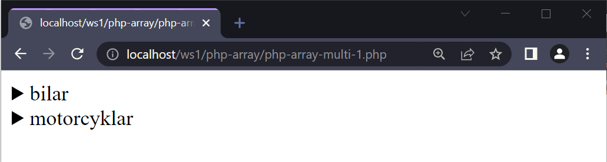

--

## Steg 3 - Inre loopen

--

```php [5-9]
foreach ($garage as $typ => $fordonslista) {
  echo "<details>";
  echo "<summary>" . $typ . "</summary>";

  echo "<ul>";
  foreach ($fordonslista as $nyckel => $fordon) {
    echo "<li>" . $fordon . "</li>";
  }
  echo "</ul>";

  echo "</details>";
}
```

--


--

## Steg 4 - Vad händer?

--

```php [16]
<?php

$garage = [
  "bilar" => [
    "Ferrari F40",
    "Volvo PV",
    "Saab Sonett",
  ],
  "motorcyklar" => [
    "Honda CMX500 Rebel",
    "Kawasaki Ninja 650",
    "Suzuki Bandit 1250SA",
  ]
];

$garage["bilar"][] = "Fiat 500";

foreach ($garage as $typ => $fordonslista) {
  echo "<details>";
  echo "<summary>" . $typ . "</summary>";

  echo "<ul>";
  foreach ($fordonslista as $nyckel => $fordon) {
    echo "<li>" . $fordon . "</li>";
  }
  echo "</ul>";

  echo "</details>";
}
```

--

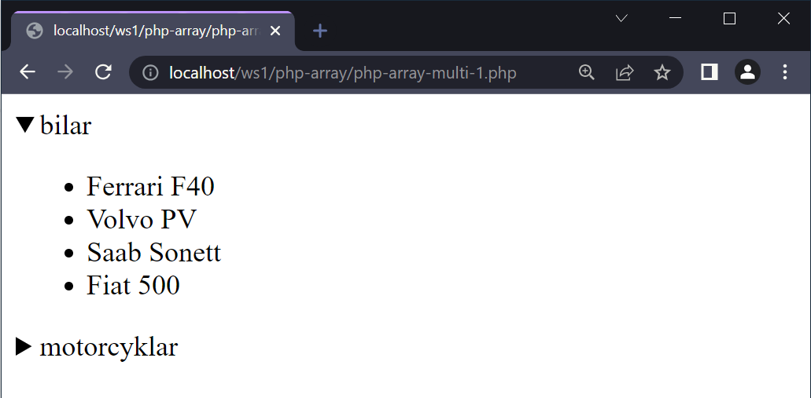

---

# Ännu mer om array:er

--

Se dokumentationen.

[https://www.php.net/manual/en/book.array.php](https://www.php.net/manual/en/book.array.php)

---

# SLUT!
