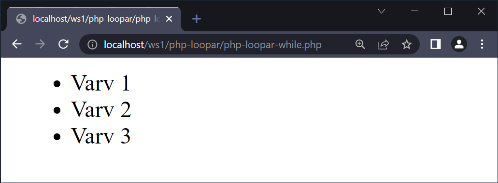
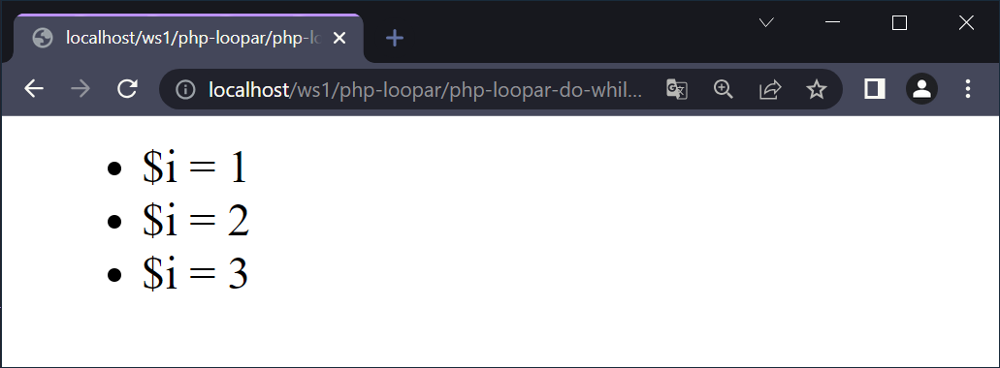
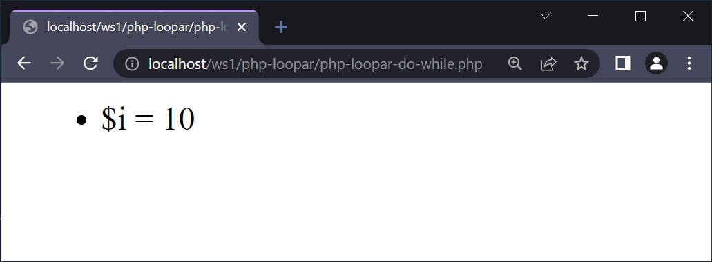
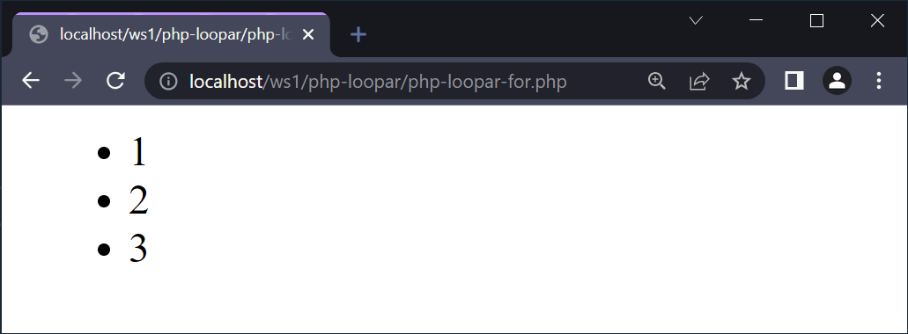
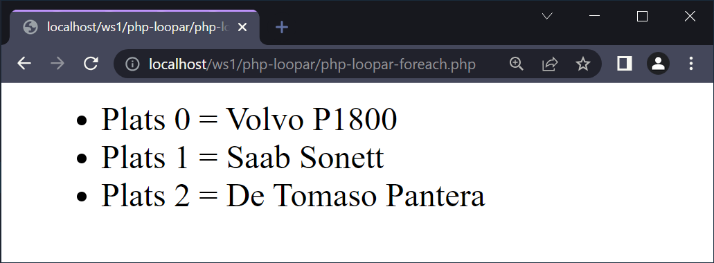
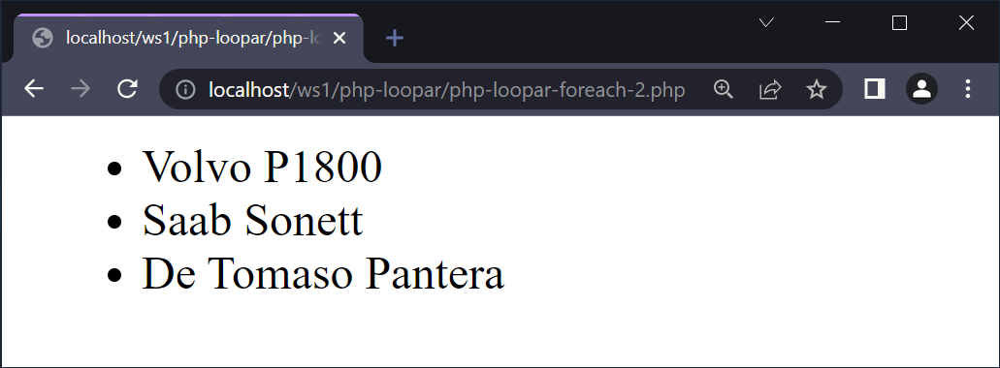

# Loopar

---

# While

--

```php []
<?php
$i = 1;

echo "<ul>";
while ($i <= 3) {
  echo "<li>Varv " . $i . "</li>";
  $i++;
}
echo "</ul>";
```

--



---

# Do..While

--

```php []
<?php
$i = 1;

$result = "<ul>";

do {
  $result .= "<li>Varv " . $i . "</li>";
  $i++;
} while ($i <= 3);

$result .= "</ul>";

echo $result;
```

--



Här är **$i = 1** vid start och do..while:n körs då tre gånger.

--



Här är **$i = 10** vid start och do..while:n körs då enbart en gång.

---

# For

--

```php []
<?php

echo "<ul>";
for ($i = 1; $i < 4; $i++) {
  echo "<li>" . $i . "</li>";
}
echo "</ul>";
```

(vart vi börjar; vart vi ska; hur vi tar oss dit)

--



---

# Foreach

--

```php []
<?php

$garage = [
  'Volvo P1800',
  'Saab Sonett',
  'De Tomaso Pantera'
];

echo "<ul>";
foreach ($garage as $plats => $fordon) {
  echo "<li>Plats $plats = $fordon</li>";
}
echo "</ul>";
```

--



--

```php []
<?php

$garage = [
  'Volvo P1800',
  'Saab Sonett',
  'De Tomaso Pantera'
];

echo "<ul>";
foreach ($garage as $fordon) {
  echo "<li>$fordon</li>";
}
echo "</ul>";
```

--



---

# SLUT!
