# Operatorer

--

En operator är något som verkar på en eller flera termer.

Det finns olika typer av operatorer och du kommer känna igen det mesta av det.

---

# Aritmetiska operatorer

--

| Operator | Namn           |
| -------- | -------------- |
| +        | Addition       |
| -        | Subtraktion    |
| \*       | Multiplikation |
| /        | Delat          |
| %        | Modulus        |
| \*\*     | Upphöjt        |

--

```php []
<?php

$a = 10;
$b = 3;

$mod = $a % $b;
$exp = $a ** $b;

echo "<p>" . $mod . "</p>";
echo "<p>" . $exp . "</p>";

```

--

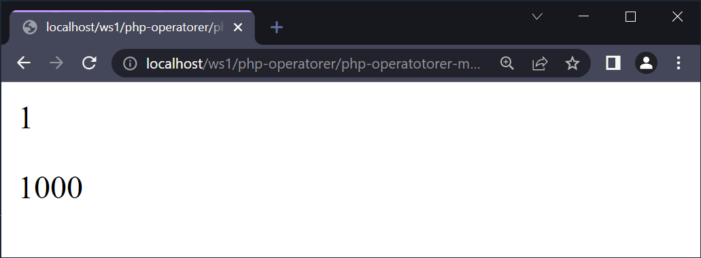

---

# Tilldelningsoperatorer

--

| Tilldelning | Samma som...   |
| ----------- | -------------- |
| $a = $b;    | $a = $b;       |
| $a += $b;   | $a = $a + $b;  |
| $a -= $b;   | $a = $a - $b;  |
| $a \*= $b;  | $a = $a \* $b; |
| $a /= $b;   | $a = $a / $b;  |
| $a %= $b;   | $a = $a % $b;  |

--

```php []
<?php

$a = 10;
$b = 2;

$a = $b;
echo "<p>" . $a . "</p>";

```

--

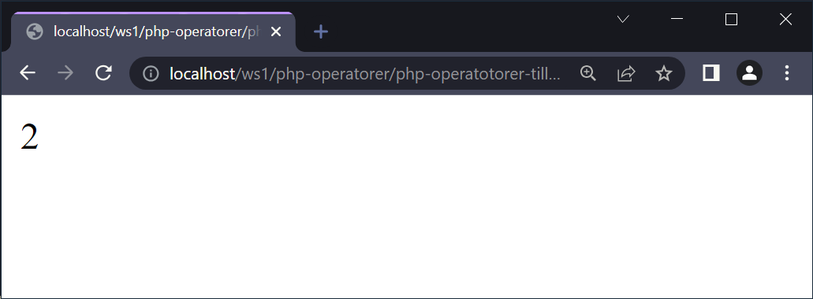

--

```php []
<?php

$a = 10;
$b = 2;

$a += $b;
echo "<p>" . $a . "</p>";

```

--

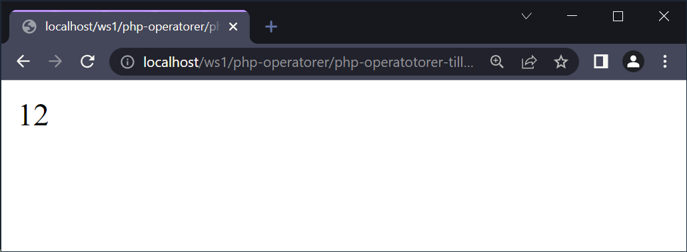

---

# Jämförelseoperatorer

--

| Operator | Namn                     |
| -------- | ------------------------ |
| ==       | Lika med                 |
| ===      | Identisk                 |
| !=       | Inte lika med            |
| <>       | Inte lika med            |
| !==      | Inte identisk            |
| >        | Större än                |
| <        | Mindre än                |
| >=       | Större än eller lika med |
| <=       | Mindre än eller lika med |
| <=>      | Rymdskepp                |

--

```php []
<?php

$a = 10;
$b = "10";

if ($a == $b) {
    echo "Lika";
}

```

--

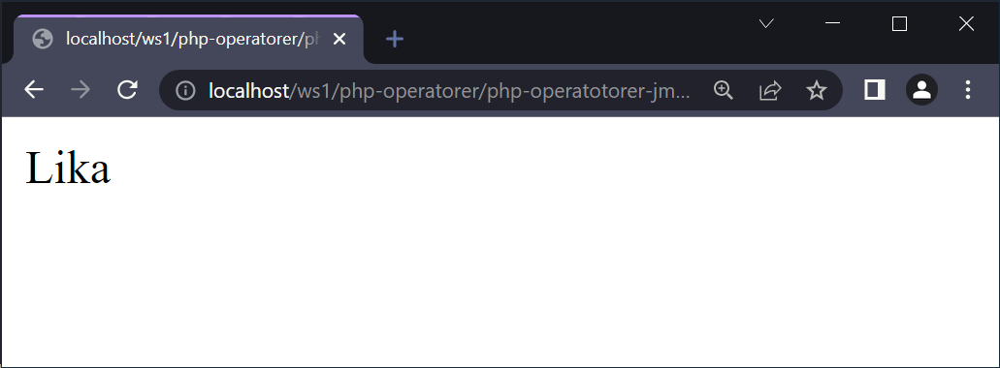

--

```php []
<?php

$a = 10;
$b = "10";

if ($a === $b) {
    echo "Identiska";
} else {
    echo "Ej Identiska";
}

```

--

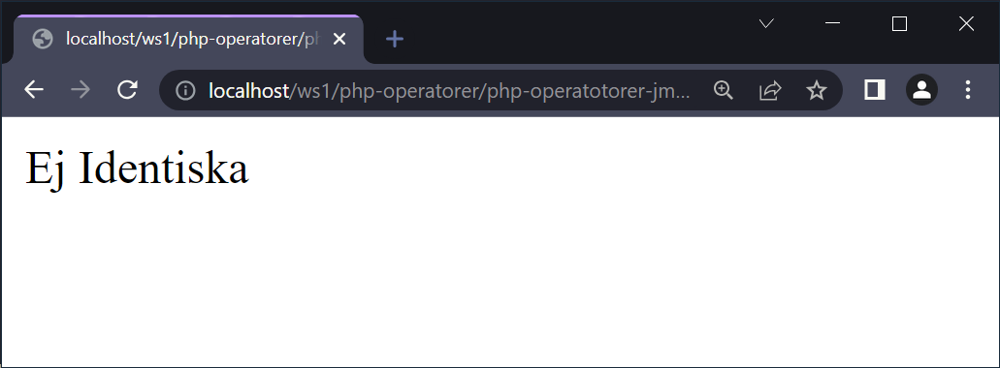

--

```php []
<?php

$x = 5;
$y = 10;

// returns -1 because $x is less than $y
echo ($x <=> $y);
echo "<br>";

$x = 10;
$y = 10;

// returns 0 because values are equal
echo ($x <=> $y);
echo "<br>";

$x = 15;
$y = 10;

// returns +1 because $x is greater than $y
echo ($x <=> $y);

```

--

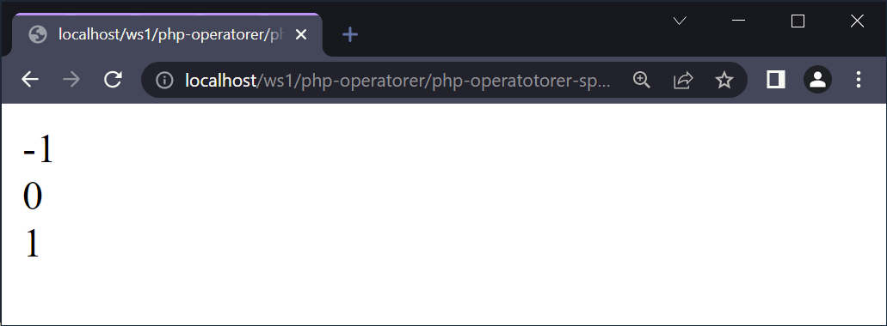

---

# Ökning/minskning operatorer

--

Vi har tillgång till **++** och **--**.

--

```php []
<?php

$a = 1;
$b = $a++;

echo "<p>" . $a . ", " . $b . "</p>";

```

--


--

```php []
<?php

$a = 1;
$b = ++$a;

echo "<p>" . $a . ", " . $b . "</p>";

```

--

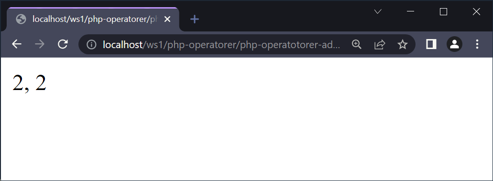

---

# Logiska operatorer

--

| Operator | Namn           | Beskrivning                                                  |
| -------- | -------------- | ------------------------------------------------------------ |
| and      | Och            | Sann om både $a och $b är sanna                              |
| or       | Eller          | Sann om någon eller båda av $a och $b är sanna               |
| xor      | Antingen eller | Sann om antingen $a och $b är sanna, men inte båda samtidigt |
| &&       | Och            | Sann om både $a och $b är sanna                              |
| \|\|     | Eller          | Sann om någon eller båda av $a och $b är sanna               |
| !        | Icke           | Sann om $a är falsk                                          |

--

```php []
<?php

$a = 100;
$b = 50;

if ($a == 100 || $b == 80) {
  $c = "Hello world!";
}

echo "<p>" . $c . "</p>";

```

--

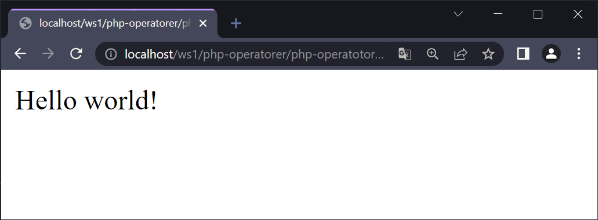

--

```php []
<?php

$a = 100;
$b = 50;

if ($a != 100 && $b != 80) {
  $c = "Hello world!";
} else {
  $c = "Errolf!";
}

echo "<p>" . $c . "</p>";
```

--

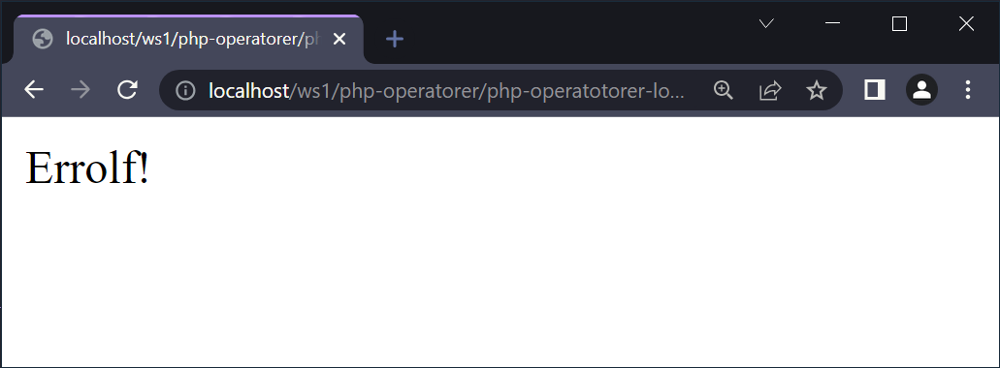

--

```php []
<?php
echo "<pre>";
/* Watch out for the difference of priority
between 'and vs &&' or '|| vs or': */

$bool = true && false;
var_dump($bool); // false, that's expected

$bool = true and false;
var_dump($bool); // true, ouch!

/*Because 'and/or' have lower priority
than '=' but '||/&&' have higher. */
echo "</pre>";
```

--

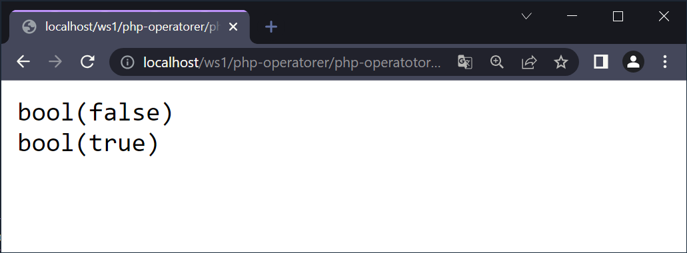

--

[https://www.php.net/manual/en/language.operators.logical.php](https://www.php.net/manual/en/language.operators.logical.php)

[https://www.php.net/manual/en/language.operators.precedence.php](https://www.php.net/manual/en/language.operators.precedence.php)

---

# Strängoperatorer

--

| Operator | Namn                     | Namn                           |
| -------- | ------------------------ | ------------------------------ |
| .        | Concatenation            | Sammankoppling                 |
| .=       | Concatenation assignment | Tilldelning via sammankoppling |

--

```php []
<?php

$a = "A";
$b = "B";

echo "<p>" . $a . "</p>";
echo "<p>" . $a . " " . $b . "</p>";

```

--

## 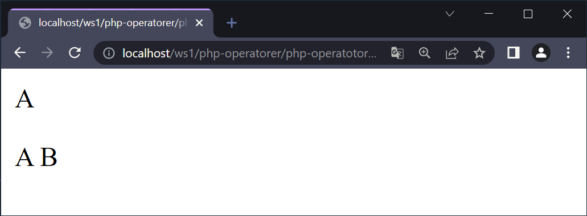

--

```php []
<?php

$a = "A";
$b = "B";

$a .= $b;

echo "<p>\$a = $a</p>";
echo "<p>\$b = $b</p>";
```

--

## 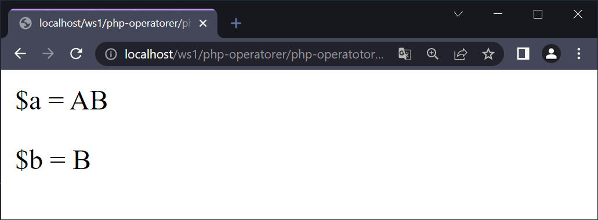

---

# SLUT!
