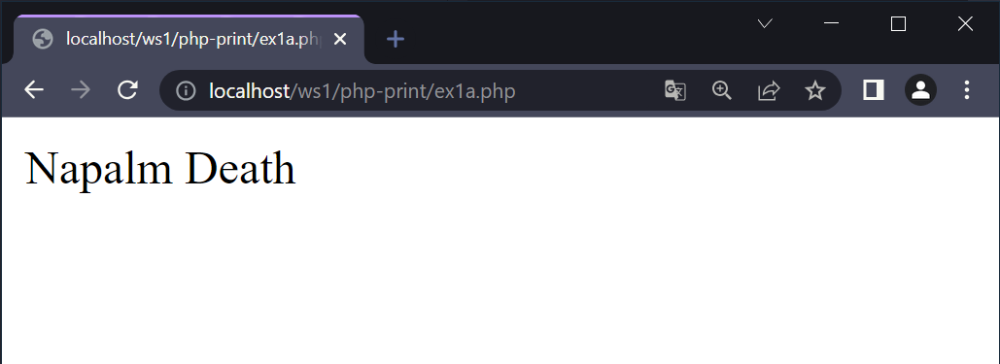
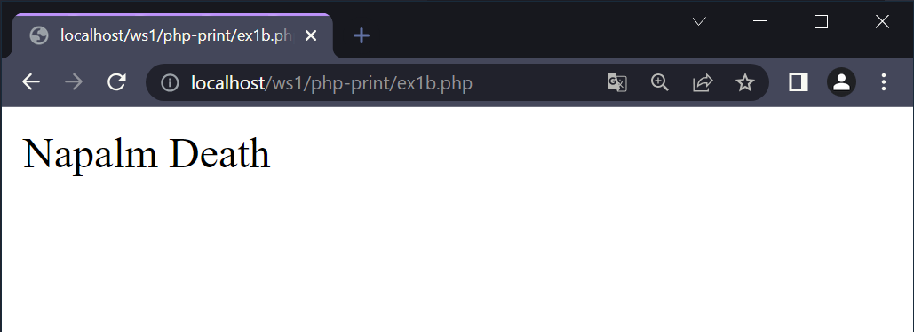
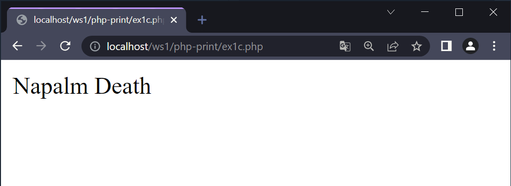
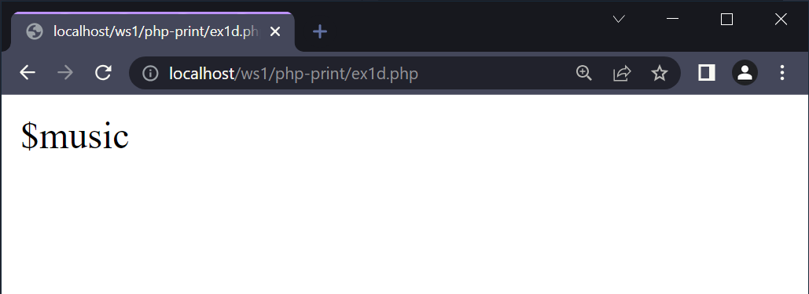
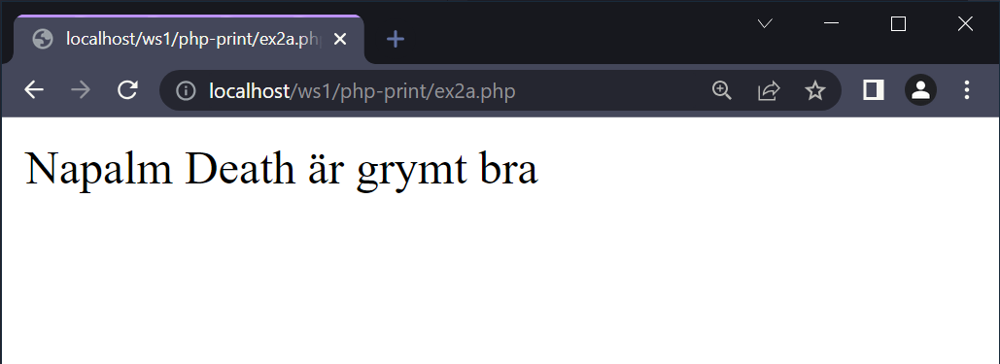
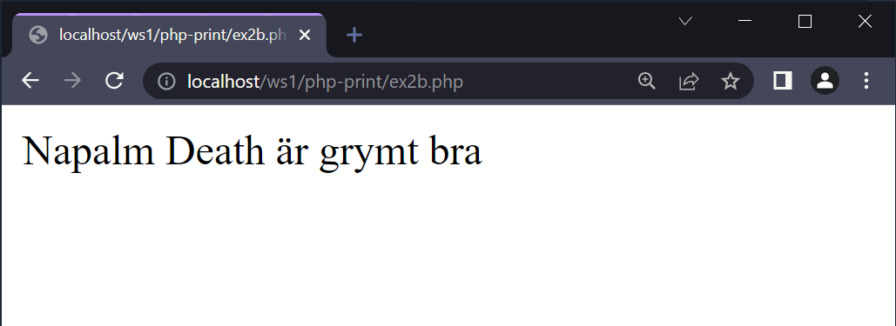
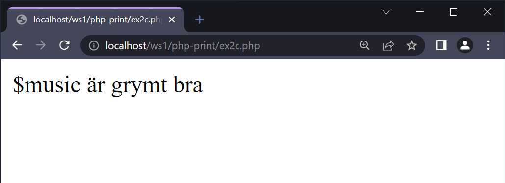
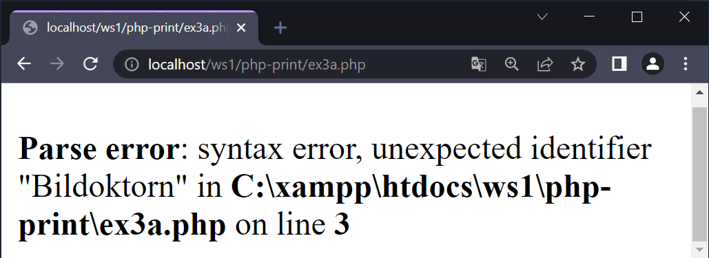
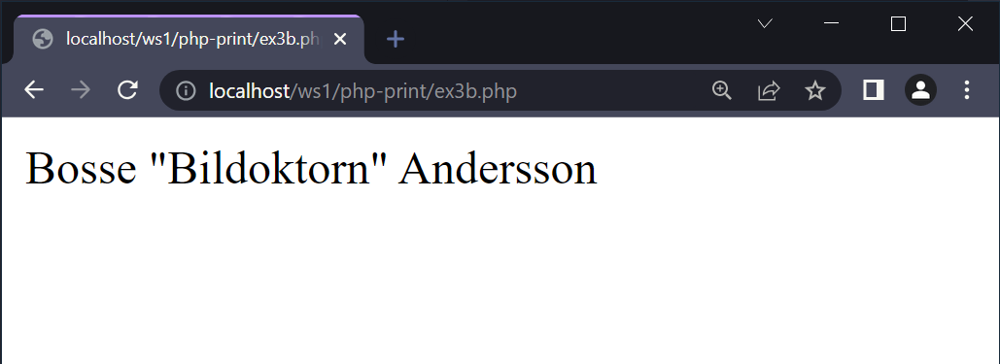
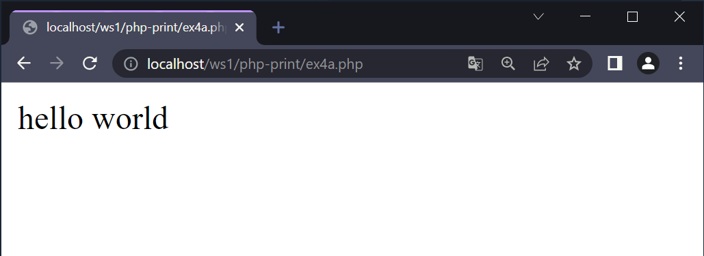

# Att skriva ut

---

# Kod - Ex1

--

```php []
<?php

$music = "Napalm Death";
echo $music;

```

--



--

```php []
<?php

$music = "Napalm Death";
echo "$music";

```

--



--

```php []
<?php

$music = 'Napalm Death';
echo $music;

```

--



--

```php []
<?php

$music = 'Napalm Death';
echo '$music';

```

--



---

# Kod - Ex2

--

```php []
<?php

$music = "Napalm Death";
echo "<p>" . $music . " är grymt bra</p>";

```

--



--

```php []
<?php

$music = "Napalm Death";
echo "<p>$music är grymt bra</p>";

```

--



--

```php []
<?php

$music = "Napalm Death";
echo '<p>$music är grymt bra</p>';

```

--



---

# Kod - Ex3

--

```php []
<?php

$namn = "Bosse "Bildoktorn" Andersson";
echo "<p>" . $namn . "</p>";

```

--



--

```php []
<?php

$namn = "Bosse \"Bildoktorn\" Andersson";
echo "<p>" . $namn . "</p>";

```

--



---

# Escapetecken

--

| Teckenkombination | Resultat            |
| ----------------- | ------------------- |
| \\"               | "                   |
| \\'               | '                   |
| \\\               | \                   |
| \\$               | $                   |
| \n                | Ny rad i HTML-koden |
| \t                | TAB i HTML-koden    |

---

# echo vs print

--

`echo` och `print` är mer eller mindre desamma.

`echo` har inget returvärde.

`print` har returvärdet **1** så det kan användas i uttryck.

--

```php []
/* Because print has a return value, it can be used
in expressions The following outputs "hello world" */
if ( print "hello" ) {
    echo " world";
}
```

--



---

# SLUT!
