# Textfiler

---

# Kontrollera om filen finns

--

```php []
<?php
// $file = "no_file.txt";
// $file = "empty.txt";
$file = "text.txt";

if (!file_exists($file)) {
  die("Filen <mark>$file</mark> finns inte.");
}

if (file_exists($file)) {
  echo "Filen finns";
}

echo "<p>Mer kod...</p>";
?>
```

--

## Ingen fil

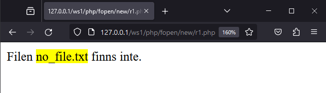

--

## Tom fil

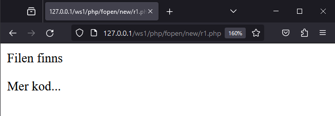

--

## Fil med innehåll


---

# Läsa filens innehåll - fread()

--

```php [9-20]
<?php
// $file = "empty.txt";
$file = "text.txt";

if (!file_exists($file)) {
  die("Filen <mark>$file</mark> finns inte.");
}

$handle = fopen($file, 'r');

if ($handle) {
  if (filesize($file) > 0) {
    $contents = fread($handle, filesize($file));
    fclose($handle);

    echo nl2br($contents);
  } else {
    echo "Filen är tom!";
  }
}
?>
```

--

## Tom fil

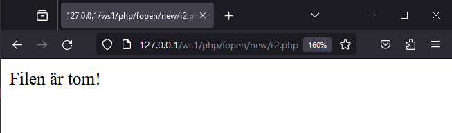

--

## Fil med innehåll

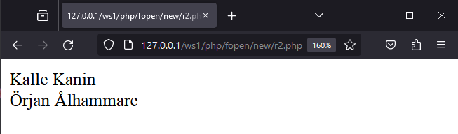

--

## HTML-koden

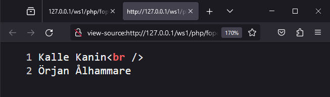

---

# Läsa filens innehåll - fgets()

--

```php [12-16]
<?php
// $file = "empty.txt";
$file = "text.txt";

if (!file_exists($file)) {
  die("Filen <mark>$file</mark> finns inte.");
}

$handle = fopen($file, 'r');

if ($handle) {
  if (filesize($file) > 0) {
    $contents = fgets($handle);
    fclose($handle);

    var_dump($contents);
  } else {
    echo "Filen är tom!";
  }
}
?>
```

--

## Tom fil

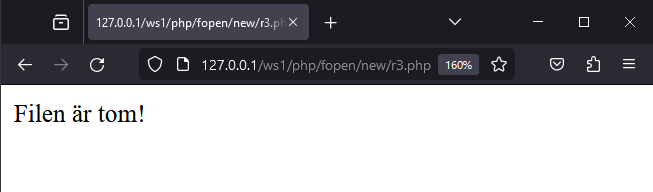

--

## Fil med innehåll

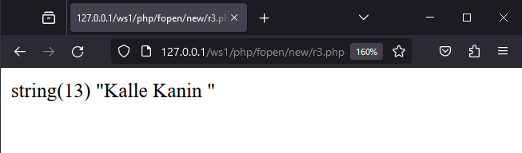

--

```php [13-17]
<?php
// $file = "empty.txt";
$file = "text.txt";

if (!file_exists($file)) {
  die("Filen <mark>$file</mark> finns inte.");
}

$handle = fopen($file, 'r');

if ($handle) {
  if (filesize($file) > 0) {
    while (!feof($handle)) {
      $lines[] = fgets($handle);
    }

    print_r($lines);

    fclose($handle);
  } else {
    echo "Filen är tom!";
  }
}
?>
```

--

## Fil med innehåll

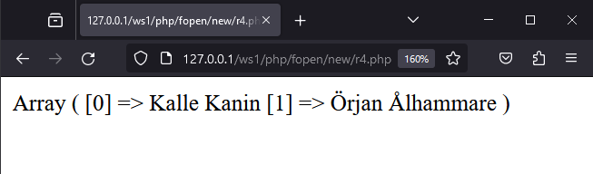

--

```php [19-23]
<?php
// $file = "empty.txt";
$file = "text.txt";

if (!file_exists($file)) {
  die("Filen <mark>$file</mark> finns inte.");
}

$handle = fopen($file, 'r');

if ($handle) {
  if (filesize($file) > 0) {
    while (!feof($handle)) {
      $lines[] = fgets($handle);
    }

    fclose($handle);

    echo "<ol>";
    foreach ($lines as $row) {
      echo "<li>" . $row . "</li>";
    }
    echo "</ol>";
  } else {
    echo "Filen är tom!";
  }
}
?>
```

--

## Fil med innehåll

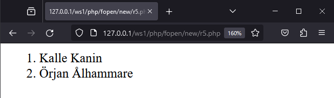

--

```php [14-18]
<?php
// $file = "empty.txt";
$file = "text.txt";
// $file = "ooops.txt";

if (!file_exists($file)) {
  die("Filen <mark>$file</mark> finns inte.");
}

$handle = fopen($file, 'r');

if ($handle) {
  if (filesize($file) > 0) {
    echo "<ol>";
    while (!feof($handle)) {
      echo "<li>" . fgets($handle) . "</li>";
    }
    echo "</ol>";

    fclose($handle);
  } else {
    echo "Filen är tom!";
  }
}
?>
```

--

## Fil med innehåll


--

## Fil med innehåll #2 (ooops)

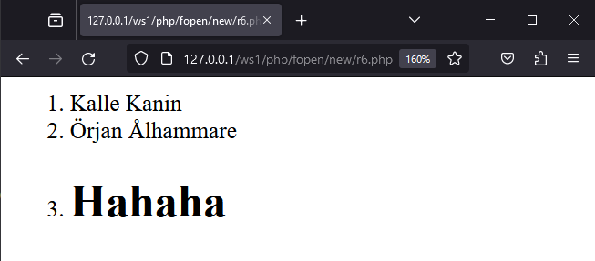

--

```php [16]
<?php
// $file = "empty.txt";
// $file = "text.txt";
$file = "ooops.txt";

if (!file_exists($file)) {
  die("Filen <mark>$file</mark> finns inte.");
}

$handle = fopen($file, 'r');

if ($handle) {
  if (filesize($file) > 0) {
    echo "<ol>";
    while (!feof($handle)) {
      echo "<li>" . htmlentities(fgets($handle)) . "</li>";
    }
    echo "</ol>";
  } else {
    echo "Filen är tom!";
  }

  fclose($handle);
}
?>
```

--

## Fil med innehåll (ooops)

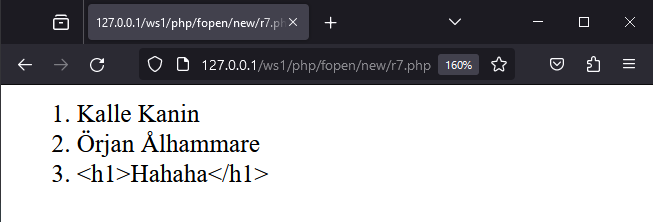

--

```php [14]
<?php
$file = "ooops.txt";

if (!file_exists($file)) {
  die("Filen <mark>$file</mark> finns inte.");
}

$handle = fopen($file, 'r');

if ($handle) {
  if (filesize($file) > 0) {
    echo "<ol>";
    while (!feof($handle)) {
      echo "<li>" . strip_tags(fgets($handle)) . "</li>";
    }
    echo "</ol>";
  } else {
    echo "Filen är tom!";
  }

  fclose($handle);
}
?>
```

--

## Fil med innehåll (ooops)

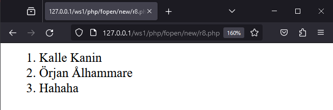


---

# Skriva till filer - Exempel #1

--

## fopen med w

```php []
<?php
$myFile = fopen("write.txt", "w") or die("Kan inte öppna filen!");
$txt = "Örjan Ålhammare";

fwrite($myFile, $txt);
fclose($myFile);
```

--

## Funderingar

**F:** Vad händer om filen inte finns?

**F:**  Vad händer när vi uppdaterar sidan?

--

**S:** Filen skapas, om vi har skrivrättigheter i mappen

**S:** Filens innehåll skrivs över!

--

## DEMO

Vi provkör!

--

## fopen med a

```php []
<?php
$myFile = fopen("write.txt", "w") or die("Kan inte öppna filen!");
$txt = "Örjan Ålhammare";

fwrite($myFile, $txt);
fclose($myFile);
?>
```

--

## Funderingar

**F:** Vad händer om filen inte finns?

**F:** Vad händer när vi uppdaterar sidan?

--

**S:** Filen skapas, om vi har skrivrättigheter i mappen

**S:** Vi skriver in sist i filen.

--

## DEMO

Vi provkör!

--

## fopens

[Länk till övriga lägen](https://www.w3schools.com/php/func_filesystem_fopen.asp)

---

# Skriva till filer - Exempel #2

```php []
<?php
$file = "write.txt";

$txt = "Örjan Ålhammare";
// $txt = "<h1>Hahaha</h1>";

if (file_exists($file)) {
  $myFile = fopen($file, "a") or die("Kan inte öppna filen!");

  $txt = strip_tags($txt);

  if (filesize($file) === 0) {
    fwrite($myFile, $txt);
  } else {
    fwrite($myFile, PHP_EOL . $txt);
  }
  fclose($myFile);

  echo "Skrivet till filen: " . $txt;
} else {
  echo "Filen finns inte";
}
?>
```

--

## DEMO

Vi provkör!

---

# Skriva till filer - Exempel #3

--

```php []
<?php
$file = "write.txt";

$txt = "Örjan Ålhammare";
// $txt = "<h1>Hahaha</h1>";

if (!file_exists($file)) {
  die("Filen <mark>$file</mark> finns inte.");
}

if (!is_writable($file)) {
  die("Filen <mark>$file</mark> går inte att skriva till.");
}

$myFile = fopen($file, "a") or die("Kan inte öppna filen!");

$txt = strip_tags($txt);

if (filesize($file) === 0) {
  fwrite($myFile, $txt);
} else {
  fwrite($myFile, PHP_EOL . $txt);
}
fclose($myFile);

echo "Skrivet till filen: " . $txt;

```

--

## DEMO

Vi provkör!

---

# Länkar att läsa

--

[PHP Filesystem Functions](https://www.w3schools.com/php/php_ref_filesystem.asp) (se de funktioner vi använder oss av)

[PHP strip_tags() Function](https://www.w3schools.com/php/func_string_strip_tags.asp)

[PHP htmlspecialchars() Function](https://www.w3schools.com/php/func_string_htmlspecialchars.asp)

---

# Slut