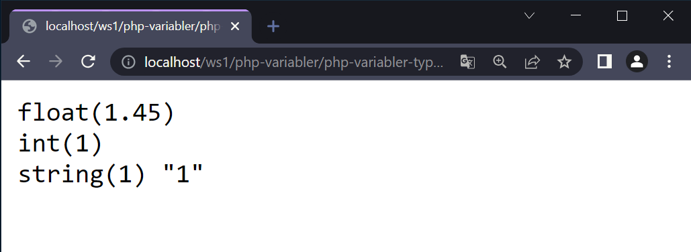

# Variabler

--

Börjar alltid med ett **$**-tecken.

Kan endast innehålla alfanumeriska tecken och understreck (**a-z**, **A-Z**, **0-9**, **\_**)

Kan innehålla **åäö**, men enligt en allmänt vedertagen konvention bör du undvika det.

Kan aldrig innehålla mellanslag.

Skillnad på stora och små bokstäver.

Vi använder oss av **camelCaps** för att namnge variabler (ex. **$lastName**)

--

Här har vi deklarerat variabeln **number** och tilldelat den ett värde om **1**.

```php []
<?php

$number = 1;

```

---

# Datayper

--

| Svensk benämning | Engelsk benämning | Exempel              |
| ---------------- | ----------------- | -------------------- |
| Boolesk          | Boolean           | TRUE eller FALSE     |
| Heltal           | Integer           | 18                   |
| Flyttal          | Float             | 3.14                 |
| Sträng           | String            | "Bo Spik"            |
| Vektor           | Array             | (1, 3, "Bo", "Spik") |
| Objekt           | Object            | Alla ovanstående     |
| Resurs           | Resource          | Databaskoppling      |
| Null             | Null              | Inget värde          |

--

## Boolesk (Boolean)

Sätts med **TRUE** eller **FALSE**

Dessa nyckelord är inte känsliga för små eller stora bokstäver.

--

```php []
<?php

$var = TRUE;

```

--

## Heltal (Integer)

Består av positiva (**0, 1 , 2, …**) och negativa (**-1, -2, -3, …**) heltal.

Plattformsberoende:

- 32-bit = 2 x 10<sup>9</sup>
- 64-bit = 9 x 10<sup>18</sup>

--

```php []
<?php

$age = 42;

```

--

## Flyttal (Float)

Används för att representera stora eller små tal som inte kan beskrivas med hjälp av heltal.

Använder decimalpunkt och inte decimalkomma.

--

```php []
<?php

$num1 = 3.14;  //3.14
$num2 = 8.5E3; //8500

```

--

## Sträng (String)

Bygger på en serie symboler och/eller nummer som väljs från en teckenuppsättning.

Finns ingen begränsning hur stor en sträng kan vara i PHP, men gränsen går vid hur mycket minne det finns på den dator där PHP är i drift.

--

```php []
<?php

$lastName = "Apelsinsson";
$helloMsg = "Tjena och välkommen!";
$helloMsg = 'Tjena och välkommen!';

```

---

# Löst typat

--

```php []
<?php

$lastName = "Hammare";
$lastName = "Gullan Hammare";
$lastName = 42;
$lastName = TRUE;

```

---

# Typkonvertering

--

Behövs ibland när man verkligen vill ha koll på datatypen.

--

```php []
<?php

echo "<pre>";
$n = 1.45;
var_dump($n);

$ex1 = (int)$n;
var_dump($ex1);

$ex2 = (string)$ex1;
var_dump($ex2);

echo "</pre>";

```

--



---

# SLUT!
