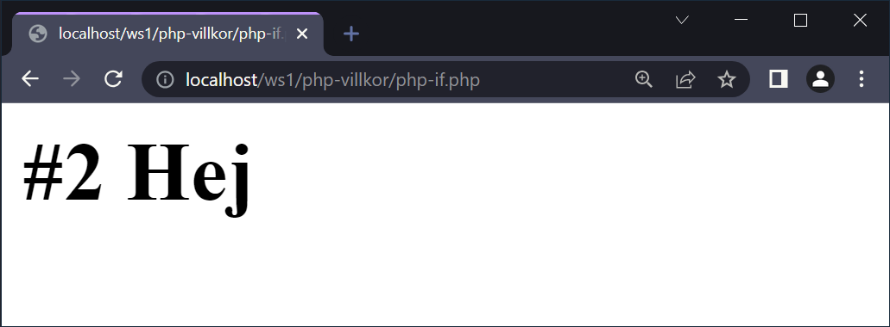
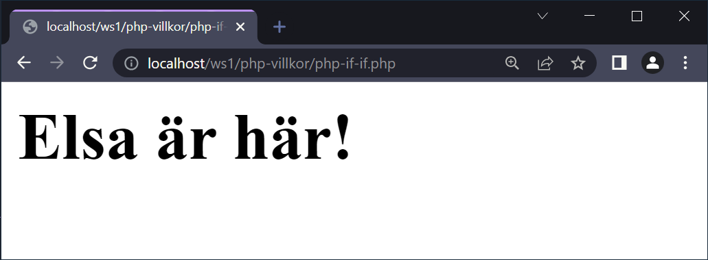
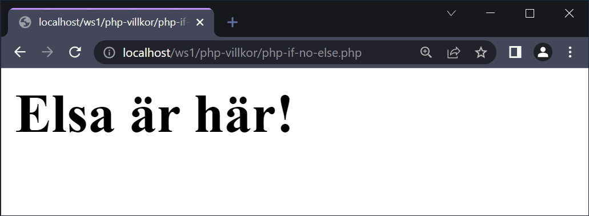
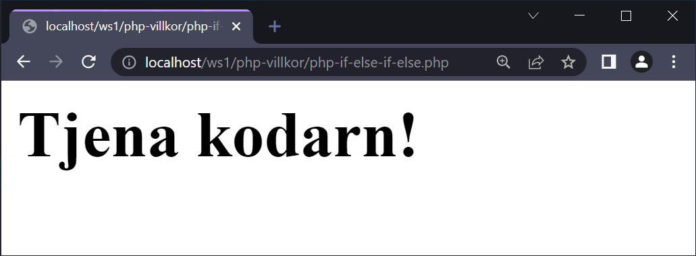
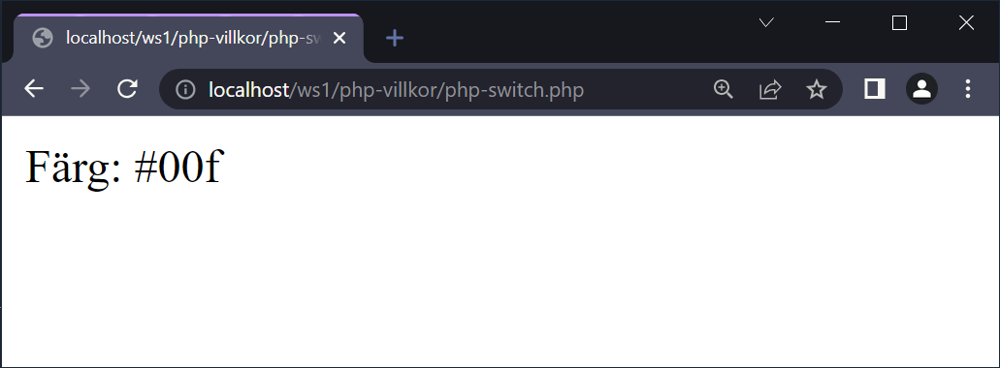
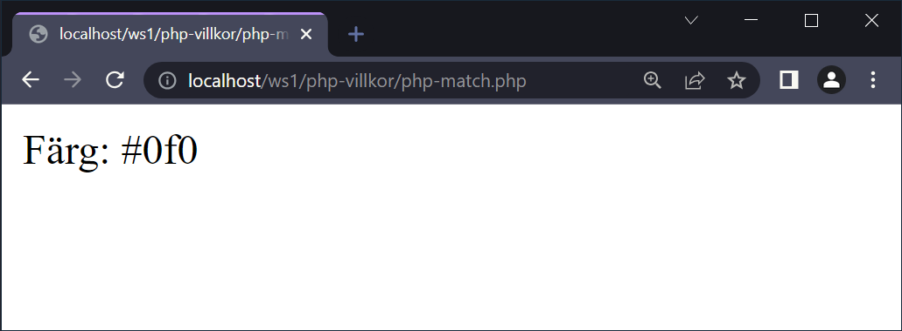

# Villkor

--

Du kommer att känna igen hur det fungerar till stora delar, förutom att syntaxen ser annorlunda ut jämfört med python.

---

# if

--

```php []
<?php

$a = "Hej";

if ($a == "hej") {
  echo "<h1>#1 " . $a . "</h1>";
}

if ($a == "Hej") {
  echo "<h1>#2 " . $a . "</h1>";
}
```

--



---

# if...else

--

```php []
<?php

$a = "Hej";

if ($a == "hej") {
  $b = "tjena teknisten!";
} else {
  $b = "Elsa är här!";
}

echo "<h1>" . $b . "</h1>";

```

--


--

## Alternativa lösningar #1

```php []
<?php

$a = "Hej";
$kontroll = "hej";

if ($a == $kontroll) {
  $b = "tjena teknisten!";
}

if ($a != $kontroll) {
  $b = "Elsa är här!";
}

echo "<h1>" . $b . "</h1>";
```

--



--

## Alternativa lösningar #2

```php []
$a = "Hej";
$b = "tjena teknisten!";

if ($a != "hej") {
  $b = "Elsa är här!";
}

echo "<h1>" . $b . "</h1>";
```

--



---

# if..elsif...else

--

```php []
<?php

$a = "Hej";

if ($a == "hej") {
  $b = "Tjena teknisten!";
} elseif ($a == "Hej") {
  $b = "Tjena kodarn!";
} else {
  $b = "Elsa är här!";
}

echo "<h1>" . $b . "</h1>";
```

--



---

# switch

--

```php []
<?php

$color = "blue";

switch ($color) {
  case "red":
    $result = "#f00";
    break;
  case "green":
    $result = "#0f0";
    break;
  case "blue":
    $result = "#00f";
    break;
  default:
    $result = "#b0b";
}

echo "<p>Färg: $result</p>";
```

--



---

# match

--

```php []
<?php

$color = "green";

$result = match ($color) {
  "red" => "#f00",
  "green" => "#0f0",
  "blue" => "#00f",
  default => "#b0b",
};

echo "<p>Färg: $result</p>";
```

[https://www.php.net/manual/en/control-structures.match.php](https://www.php.net/manual/en/control-structures.match.php)

--



---

# Ternary Operator

--

```php []
<?php
$a = 10;
$b = 20;

if ($a == $b) {
  $r = "Hej";
} else {
  $r = "Hallå";
}
?>

<p>Svar: <?= $r ?></p>
```

--

```php [6]
<?php

$a = 110;
$b = 10;

$r = $a == $b ? "Hej" : "Hallå";
?>

<p>Svar: <?= $r ?></p>
```


---

# SLUT!
